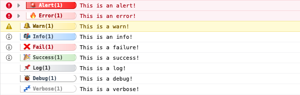
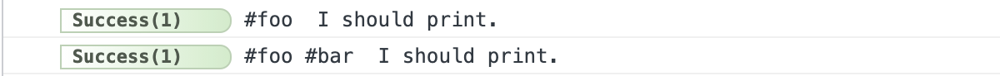

# Config

Adze is a completely configurable library by design that comes with sensible defaults. There are two primary configurations to understand; the Adze configuration and the Shed configuration. In this section we'll take a look at each configuration and explain each property in detail.

## Adze Configuration

### Interface

```typescript
// This is the top level Adze configuration
interface Configuration {
  log_level?: number;
  use_emoji?: boolean;
  capture_stacktrace?: boolean;
  base_style?: string;
  log_levels?: LogLevels;
  custom_levels?: Partial<LogLevels>;
  meta?: {
    [key: string]: unknown;
  };
}

// The allowable values for the method property
type ConsoleMethod =
  | 'error'
  | 'warn'
  | 'info'
  | 'log'
  | 'debug'
  | 'trace'
  | 'group'
  | 'groupCollapsed'
  | 'groupEnd'
  | 'table'
  | 'dir'
  | 'dirxml';
```

### Descriptions

| Property Name      | Default Value                                 | Description                                                                                   |
| ------------------ | --------------------------------------------- | --------------------------------------------------------------------------------------------- |
| log_level          | 8                                             | The highest log level that will be allowed to render.                                         |
| use_emoji          | false                                         | Toggle emoji's on or off for log rendering.                                                   |
| capture_stacktrace | false                                         | Logs will record their stacktrace when they are created. Disabled by default for performance. |
| base_style         | [Reference](#styling)                         | These styles will be applied to all default log levels.                                       |
| log_levels         | [Reference](#log-levels-log-level-definition) | Configuration for default Adze log levels.                                                    |
| custom_levels      | [Reference](#log-levels-log-level-definition) | Configuration for custom Adze log levels.                                                     |
| meta               | `{}`                                          | Key/value pairs of data to be applied to all logs by default.                                 |

## Shed Configuration

When you create a Shed you can provide it with configuration to control it's caching, [filtering](#filters), and [configuration](#adze-configuration) overrides.

### Interface

```typescript
// This is the top level Adze log configuration
interface ShedConfig {
  cache_limit: number;
  global_cfg: Configuration | null;
  filters: AdzeFilters;
}
```

### Descriptions

| Property Name | Default Value                    | Description                                                                           |
| ------------- | -------------------------------- | ------------------------------------------------------------------------------------- |
| cache_limit   | 300                              | The maximum number of logs that Shed will cache. This exists to prevent memory leaks. |
| global_cfg    | [Reference](#adze-configuration) | Adze configuration that will override all other Adze log configurations.              |
| filters       | [Reference](#filters)            | Filters for log levels, labels, and namespaces.                                       |

## Log Levels / Log Level Definition

The log levels object is made up of key/value pairs where the key is the name of the log level and the value is an object containing configuration about that log level. All properties for a log level definition are required _unless_ you are applying overrides to default log levels.

### Interface

```typescript
/* These are the configurations for default log levels
   and custom log levels. */
type LogLevels = {
  [method: string]: LogLevelDefinition;
};

interface LogLevelDefinition {
  level: number;
  method: ConsoleMethod;
  style: string;
  terminal: ChalkStyle[];
  emoji: string;
}
```

### Example

```javascript
import { adze } from 'adze';

const config = {
  log_level: 11,
  use_emoji: true,
  // Overriding some default log level settings
  log_levels: {
    log: {
      emoji: '🧙‍♂️', // We'll change the default log emoji to a wizard for funsies
    },
  },
  custom_levels: {
    // We'll create a new log level called foobar that goes to 11
    foobar: {
      level: 11,
      method: 'error',
      style:
        'padding-right: 25px; background: linear-gradient(to right, white, red); color: white; border-color: black;',
      terminal: ['bgRed', 'white'],
      emoji: '🤬',
    },
  },
};

adze(config).log("I'm a wizard!"); // Magic!
adze(config).custom('foobar', '#$%&%#$@&!'); // Anger!
```

### Output


## Styling

Although Adze comes with some pretty default styles, all logs within Adze can have their styling customized. Default log level styling is a combination of the `base_style` property plus the `style` property on its [log level definition](#log-levels--log-level-definition). For styling logs in the terminal, each log level definition exposes a `terminal` property that is an array of [Chalk](https://github.com/chalk/chalk) style functions. This section contains a breakdown of what those default styles are as well as a list of possible values for the chalk styles.

### Default Browser Styles

This is a comprehensive list of the default browser styles. If you notice, these styles use `padding-right` for spacing and alignment. It is a painful way to do this, but due to the different ways each browser handles log styling, the only consistent way for them to align on the right is to use manual padding numbers. The goal of the default styles was to make them as consistent as possible across browsers.

**For more information:** [MDN Docs - refer to "Styling console output" section](https://developer.mozilla.org/en-US/docs/Web/API/Console)

#### Base Style

`font-size: 10px; font-weight: bold; border-radius: 0 10px 10px 0; border-width: 1px; border-style: solid;`

#### Default Level Styles

_NOTE: The default styles use [template string interpolation](https://developer.mozilla.org/en-US/docs/Web/JavaScript/Reference/Template_literals) to change the padding based on the browser environment._

| Level Name | emoji | Style                                                                                                                                            |
| ---------- | ----- | ------------------------------------------------------------------------------------------------------------------------------------------------ |
| alert      | 🚨    | `padding-right: 26px; background: linear-gradient(to right, #fc8585, #fc2323); color: #fff; border-color: #b70101;`                              |
| error      | 🔥    | `padding-right: ${Env.isChrome() ? '29' : '26'}px; background: linear-gradient(to right, #fff, #ffd1d1); color: #a4000f; border-color: #e3bbbb;` |
| warn       | 🔔    | `background: linear-gradient(to right, #fff, #fff0a8); color: #715100; border-color: #e3d696; padding-right: ${Env.isChrome() ? '34' : '44'}px;` |
| info       | 📬    | `padding-right: ${Env.isSafari() ? '49' : '44'}px; background: linear-gradient(to right, #fff, #b2d7ff); color: #465464; border-color: #96b5d7;` |
| fail       | ❌    | `padding-right: ${Env.isChrome() ? '43' : '44'}px; background: linear-gradient(to right, #fff, #ffd1d1); color: #a4000f; border-color: #e3bbbb;` |
| success    | 🎉    | `padding-right: 26px; background: linear-gradient(to right, #fff, #ceedc9); color: #4e594d; border-color: #b7d1b3;`                              |
| log        | 📌    | `padding-right: 50px; background: linear-gradient(to right, #fff, #d9dce0); color: #333435; border-color: #bfc1c5;`                              |
| debug      | 🐞    | `padding-right: 38px; border-right: 1px solid #d9dce0; color: #465464; border-color: #999999;`                                                   |
| verbose    | 💤    | `padding-right: 26px; border-color: 1px solid #d9dce0; color: #999999; border-color: #cbc9c9;`                                                   |

#### Output



### Default Terminal Styles

Adze styling for the terminal makes use of a library named [Chalk](https://github.com/chalk/chalk). Chalk exposes several formatting functions for terminal text styling that Adze exposes in its configuration.

#### Default Level Styles

| Level Name | emoji | Style                        |
| ---------- | ----- | ---------------------------- |
| alert      | 🚨    | `['white', 'bold', 'bgRed']` |
| error      | 🔥    | `['bgRed', 'white']`         |
| warn       | 🔔    | `['bgYellow', 'gray']`       |
| info       | 📬    | `['bgBlue', 'white']`        |
| fail       | ❌    | `['bgRed', 'white']`         |
| success    | 🎉    | `['bgGreen', 'gray']`        |
| log        | 📌    | `['bgGray', 'white']`        |
| debug      | 🐞    | `['bgBlack', 'white']`       |
| verbose    | 💤    | `['italic', 'white']`        |

#### Available Chalk Styles

| Text          | Background      | Style         |
| ------------- | --------------- | ------------- |
| black         | bgBlack         | reset         |
| red           | bgRed           | bold          |
| green         | bgGreen         | dim           |
| yellow        | bgYellow        | italic        |
| blue          | bgBlue          | underline     |
| magenta       | bgMagenta       | inverse       |
| cyan          | bgCyan          | hidden        |
| white         | bgWhite         | strikethrough |
| gray          | bgGray          | visible       |
| grey          | bgGrey          |               |
| blackBright   | bgBlackBright   |               |
| redBright     | bgRedBright     |               |
| greenBright   | bgGreenBright   |               |
| yellowBright  | bgYellowBright  |               |
| blueBright    | bgBlueBright    |               |
| magentaBright | bgMagentaBright |               |
| cyanBright    | bgCyanBright    |               |
| whiteBright   | bgWhiteBright   |               |

#### Output


## Filters

Filters are used with [Shed](shed-concepts.md) to determine whether logs are allowed to print to the console/terminal based on their log level, [label](../guide/modifiers.md#label), or [namespace](../guide/modifiers.md#namespace-ns). When filtering levels, you can provide a [level filter](../guide/data.md#level-filter) data type.

Each filter type can specify and `include` or `exclude` statement. Include tells Adze to only render logs that are included in the value set. Exclude says to not render any logs that are included in the value set. If both are specified, include takes precedence over exclude in case of conflicts.

### Interface

```typescript
export interface AdzeFilters {
  hideAll?: boolean;
  level?: GlobalFilterOptions<LevelFilter>;
  label?: GlobalFilterOptions<string[]>;
  namespace?: GlobalFilterOptions<string[]>;
}

export interface GlobalFilterOptions<T> {
  include?: T;
  exclude?: T;
}
```

### Example

```typescript
import { adze, createShed } from 'adze';

createShed({
  filters: {
    namespace: {
      include: ['foo'],
    },
  },
});

adze().ns('foo').log('First log');
adze().ns(['foo', 'bar']).log('Second log');
adze().ns('bar').log('Third log');
```

### Output




