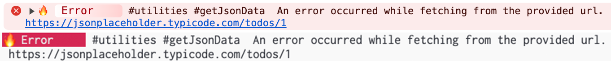
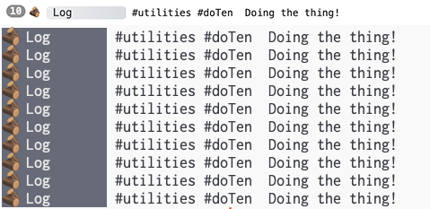
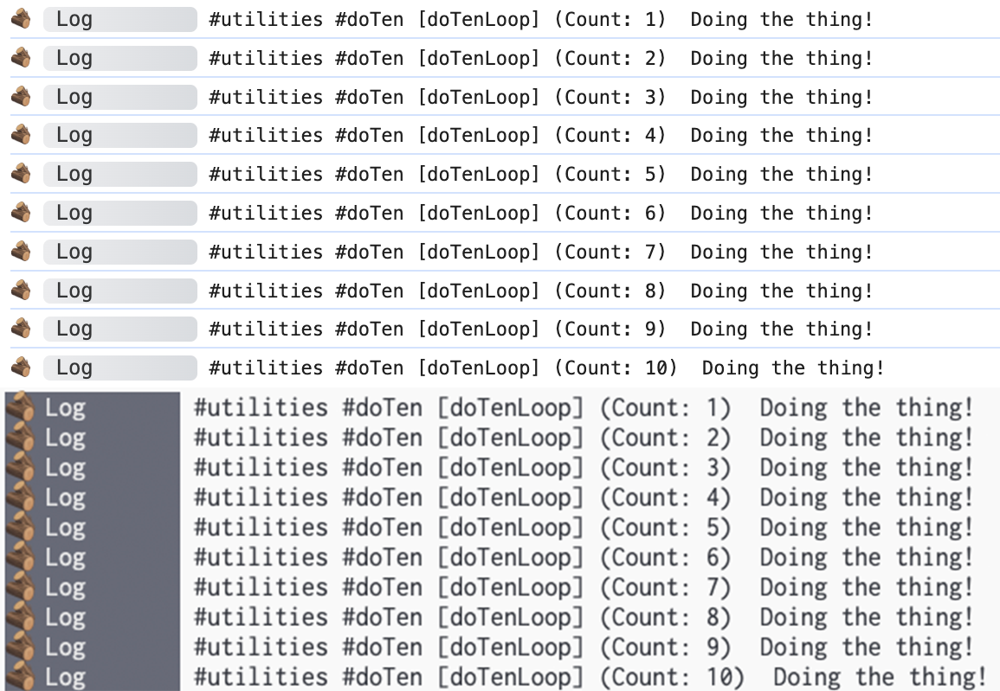

# Annotating Logs

When logging, often there is extra information we would like to know about the context of the log.

For instance, if I generate a log inside of a utility function, I might want to know that's where
it came from when I'm reading through my logs at a later time.

This is where **namespaces** and **labels** come in to help.

Let's assume a file structure for our project like this:

- `src/`
  - `index.ts`
  - `logger.ts`
  - `utilities.ts`

## Using Namespaces

We'll assume we have already set up our logger for our project in `logger.ts` that just uses emoji's
and we would like to write a utility function to fetch a value from a remote source.

```typescript
// utilities.ts
import logger from './logger';

/**
 * Fetch data and return the body as an object.
 */
export async function getJsonData(url: string) {
  try {
    const response = await fetch(url);
    return await response.json();
  } catch (e) {
    logger.error('An error occurred while fetching from the provided url.', url);
  }
}
```

In our example above, if the resource at the provided URL returns an error response, the function
will catch it and log an error message.

However, when sifting through our logs, we might not know that this error originated from the
`utilities.ts / getJsonData()` function.

Let's apply some namespaces to the error log to annotate the logs source. You can use the
`.namespace()` modifier to apply the namespace.

You can alternatively use the `.ns()` modifier alias which is just shorthand for the namespace
modifier. We'll use the shorter `.ns()` for our example.

```typescript
// utilities.ts
import logger from './logger';

/**
 * Fetch data and return the body as an object.
 */
export async function getJsonData(url: string) {
  try {
    const response = await fetch(url);
    return await response.json();
  } catch (e) {
    logger
      .ns('utilities', 'getJsonData')
      .error('An error occurred while fetching from the provided url.', url);
  }
}
```

When we run our application, we will see a log that looks like the following when an error occurs
in the `getJsonData` function.

#### Example Output



> Notice, the log output contains `#utilities #getJsonData` which indicates the namespaces.

Great! We have a log with namespaces to help us identify it's origin.

But what happens if we have many utility functions? Do we have to repeat ourselves by writing
`.ns('utilities')` every time?

Fortunately, Adze let's us progressively enhance our logs through the `seal()` terminator. Let's
look at how we can apply a namespace of **"utilities"** to all logs within the `utilities.ts` file.

```typescript
// utilities.ts
import _logger from './logger'; // <-- Change the import name to "_logger" from "logger"

// We'll define a local logger for this file that applies the "utilities" namespace.
const logger = _logger.ns('utilities').seal();

/**
 * Fetch data and return the body as an object.
 */
export async function getJsonData(url: string) {
  try {
    const response = await fetch(url);
    return await response.json();
  } catch (e) {
    logger.ns('getJsonData').error('An error occurred while fetching from the provided url.', url);
  }
}

/**
 * Validates that two unknown values are numbers and then adds them together.
 */
export function addValues(val1: unknown, val2: unknown) {
  // Check if our values are numbers first.
  if (!isNumber(val1) || !isNumber(val2)) {
    logger.ns('addValues').warn('One or both of the values to add was not a number!');
  }
  return val1 + val2;
}

/**
 * Type Guard to validate that the value is a number.
 */
export function isNumber(value: unknown): value is number {
  return value !== null && !isNaN(Number(value));
}
```

#### Example Output


## Using Labels

When writing logs we can also apply a label to the log using the `label()` modifier.

Labels differ from namespaces in a couple ways.

- Only one label may be applied to a log.
- Labels associate logs together for modifiers like `count` and `time` and for other features like [threads]().

Let's revisit our utility functions above and let's add a new function that executes a callback
function 10 times and generates a log that counts its iterations.

```typescript
// utilities.ts
import _logger from './logger';
const logger = _logger.ns('utilities').seal();

// ...other functions hidden for brevity

/**
 * Does something 10 times.
 */
export function doTen(cb: () => void) {
  for (let i = 0; i < 10; i++) {
    logger.ns('doTen').count.log('Doing the thing!');
    cb();
  }
}
```

#### Example Output



---

Notice here that no counter was applied to the generated logs. This is because in order for the logs
to be properly counted, they must be associated with each other via a label. Let's fix our mistake.

```typescript
// utilities.ts
import _logger from './logger';
const logger = _logger.ns('utilities').seal();

// ...other functions hidden for brevity

/**
 * Does something 10 times.
 */
export function doTen(cb: () => void) {
  for (let i = 0; i < 10; i++) {
    logger.ns('doTen').label('doTenLoop').count.log('Doing the thing!'); // <-- Add a label of 'doTenLoop'
    cb();
  }
}
```

#### Example Output



---

Now we see in the output above the name of the label `[doTenLoop]` as well as the counter showing
the number of times this log was called; `(Count: n)`.
