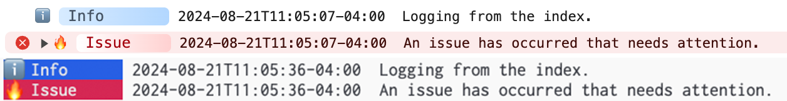

# Configuration

Now that we have a shared logger from the [setup](./setup) section we may want to apply some more
advanced configuration. In the following steps we'll take a look at how to change the active log
level, change the output format of our logs, and even add a completely custom log level.

## Set the Active Log Level

When we are writing logs for our applications, there are many different levels of information that
we want to capture. However, we do not always want to see every level of detail at all times. This
is where log levels come into play.

Log levels are categorized by the most severe being the lowest to the most [innocuous](https://www.merriam-webster.com/dictionary/innocuous)
being the highest.

By ordering our logs by severity in this way, when problems arise, we can simply
raise our active log level and all logs that are less than or equal to the active level will be
rendered. This allows us to capture only the most important logs the majority of the time, but in
cases where we need to debug something, we can increase the visibility into our application.

Adze comes with **9** log levels by default, ranging from levels **0 through 8**.

0. **Alert** - This level should only be used for logs that require immediate attention. This should be used sparingly and only for the most critical of errors.
1. **Error** - Use this for logging fatal errors or errors that impact functionality of your application.
2. **Warn** - Use this for logging issues that may impact app performance in a less impactful way than an error.
3. **Info** - Use this for logging general insights into your application. This level does not indicate any problems.
4. **Fail** - Use this for logging network communication errors or other non-fatal errors that do not break your application.
5. **Success** - Use this for logging successful network communications or other successful operations within your app.
6. **Log** - Use this for general logging that doesn't apply to any of the lower levels.
7. **Debug** - Use this for logging information that you typically do not want to see unless you are debugging a problem with your application. This is typically hidden by default.
8. **Verbose** - Use this for logging extremely detailed debugging information. Use this level when the values you are logging are granular enough that they are no longer easily human readable.

:::tip
By default the active level is set to 6.
:::

Let's lower our active level so that we only see alert, error, warn, and info logs.

```typescript
// ./src/logger.ts
import adze, { setup } from 'adze';

// Set our active level to 3
setup({
  activeLevel: 3,
});

const logger = adze.withEmoji.timestamp.seal();
export default logger;
```

Adze also supports using **level names** for setting the active level. We'll use this going forward
since it's more readable.

```typescript
// ./src/logger.ts
import adze, { setup } from 'adze';

// Set our active level to 'info' which is equivalent to 3
setup({
  activeLevel: 'info',
});

const logger = adze.withEmoji.timestamp.seal();
export default logger;
```

When we run our application, all alert, error, warning, and info logs will render and all other logs
will be hidden.

Since we would still like to see our log in `index.ts`, let's change that to an info level.

```typescript
// ./src/index.ts
import logger from './logger';

// Change -> logger.log('Logging from the index.');
logger.info('Logging from the index.');
```

## Structured Logging (JSON)

Now that we have our active log level configured, we decide that what's best for our application is
to generate logs as structured data, also known as JSON logs.

Adze comes with four log formatters built in:

- [**Pretty**](../reference/formatters.md#pretty-formatter) - Human readable, pretty printed logs.
- [**JSON**](../reference/formatters.md#json-formatter) - Machine readable, structured JSON logs.
- [**Common**](../reference/formatters.md#common-formatter) - Logs that conform to the [Common Log Format](https://en.wikipedia.org/wiki/Common_Log_Format)
- [**Standard**](../reference/formatters.md#standard-formatter) - Logs that are human-readable but formatted for stdout in backend/terminal environments.

Let's configure our shared logger to output as JSON.

```typescript
// ./src/logger.ts
import adze, { setup } from 'adze';

// Set the format to "json"
setup({
  activeLevel: 'info',
  format: 'json',
});

const logger = adze.withEmoji.timestamp.seal();
export default logger;
```

Now run the code.

#### Example Output

Oops! When we run our code we ge the following error:

```
Error: Required fields are missing from the log meta for generating a JSON log.
```

---

Certain formatters require specific meta data for generating the logs.

In this case, the **JSON formatter** requires the following fields:

- **hostname** - The name of the machine or client that is running the code.
- **name** - The name of the application that is running.

There are two ways we can provide this meta data to the logger.

The first way is through the `setup` function. The second way is by the `meta` modifier.

Adze also provides a convenient type (`JsonLogFormatMeta`) that can be used for type safety when
adding the meta data.

#### By the setup function

```typescript
// ./src/logger.ts
import adze, { setup, type JsonLogFormatMeta } from 'adze';

// Set the format to "json"
setup<JsonLogFormatMeta>({
  activeLevel: 'info',
  format: 'json',
  meta: {
    hostname: 'localhost',
    name: 'myapp',
  },
});

const logger = adze.withEmoji.timestamp.seal();
export default logger;
```

#### By the meta modifier

```typescript
// ./src/logger.ts
import adze, { setup, type JsonLogFormatMeta } from 'adze';

// Set the format to "json"
setup({
  activeLevel: 'info',
  format: 'json',
});

const logger = adze
  .meta<JsonLogFormatMeta>({
    hostname: 'localhost',
    name: 'myapp',
  })
  .withEmoji.timestamp.seal();
export default logger;
```

#### Example Output

```
{"v":1,"level":3,"levelName":"info","name":"myapp","hostname":"localhost","msg":"Logging from the index.","args":[],"pid":1,"time":"2024-08-21T10:15:38-04:00"}
```

---

Notice, even though we configured the `withEmoji` modifier on the logger, no emoji is rendered. This
is because not every formatter will abide by every configuration value. It would not make sense to
include emoji's in a machine-readable log.

Before continuing, let's change our format back to the default of `"pretty"` and remove the meta
data.

```typescript
// ./src/logger.ts
import adze, { setup } from 'adze';

// Set the format to "json"
setup({
  activeLevel: 'info',
});

const logger = adze.withEmoji.timestamp.seal();
export default logger;
```

## Create a Custom Log Level

Sometimes when we use a logger it can be useful to create a custom log level.

For instance, let's say that we want an error logger that is less important than the default error
level and the same importance as a warning. We can create a custom log level to handle this
condition.

Let's create a new log level named **"issue"**.

To create the log level we first must create a `LevelConfig` object. If you are using TypeScript
you can import the type from Adze to assist with filling out the required fields.

```typescript
// ./src/logger.ts
import adze, { setup, type LevelConfig } from 'adze';

// Here we create the configuration for our new custom level named "issue"
const issue: LevelConfig = {
  levelName: 'issue',
  level: 2,
  method: 'error',
  style:
    'padding-right: 32px; font-size: 12px; border-radius: 4px; background: linear-gradient(to right, #fff, #ffd1d1); color: #a4000f; border-color: #e3bbbb;',
  terminalStyle: ['white', 'bgRed'],
  emoji: '🔥',
};

// Set the format to "json"
setup({
  activeLevel: 'info',
  levels: {
    issue, // <-- Add the issue level configuration value here.
  },
});

const logger = adze.withEmoji.timestamp.seal();
export default logger;
```

Now that we have added our custom log level, let's go to `index.ts` and write a log for our new
level.

```typescript
// ./src/index.ts
import logger from './logger';

logger.info('Logging from the index.');
logger.custom('issue', 'An issue has occurred that needs attention.');
```

#### Example Output



---

Adze will always apply namespaces in an additive manner. Inherited namespaces will never be
overwritten by subsequent calls to the `namespace` modifier.
