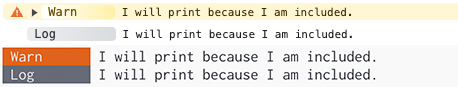

# Filtering Logs

When working in large applications, often you will have a large number of logs that are generated.
With a large number of logs it can be difficult to sift through them to find the logs that you care
about.

Adze offers a few ways to help deal with filtering your logs so that you can focus on the ones that
are currently relevant to you.

When setting up Adze, in the configuration you can provide criteria for what logs will be rendered
based on either their label, namespace, or level. This filter can either `"include"` or `"exclude"`
logs.

- If the **include** filter type is used, only logs that match the values will be printed.
- If the **exclude** filter type is used, any logs that match the values will not be printed.

## Filtering Namespaces

Let's take a look at an example of how to apply an `"include"` filter against some logs with
namespaces.

```typescript
import adze, { setup } from 'adze';

setup({
  filters: {
    namespaces: {
      type: 'include',
      values: ['foo', 'bar'],
    },
  },
});

adze.ns('foo').warn("I will print because I'm included.");
adze.ns('bar').info("I will print because I'm included.");
adze.ns('baz').log('I will NOT print because I am not included.');
adze.ns('foo', 'baz').log("I will print because I'm included.");
adze.log('I will not print because I do not have any namespaces.');
```

#### Example Output


---

Filtering by namespaces is particularly useful when debugging as it allows you to focus on a
specific code module without the noise of other logs. There is, however, one drawback that can
make filtering by namespaces cumbersome.

> How do I know what the namespaces in my app are?

### Restricting Namespaces (TS Only)

If your application uses TypeScript, Adze provides a convenient way to force all namespaces to be
registered in a centralized location. This is especially helpful because it forces developers to
keep a running list of all namespaces in use. This makes it much easier to know which namespaces to
filter by.

Let's look at an example of restricting namespaces.

```typescript
import adze, { setup } from 'adze';

// Let's create a TS type for the valid namespaces in our application
type ValidNamespaces = 'foo' | 'bar';

setup();

const logger = adze.timestamp.seal<ValidNamespaces>();
```

Now, in other places in our app where we import our sealed logger we will only be able to apply
namespaces of `"foo"` and `"bar"`.

Let's look at an example where we try to use an invalid namespace.

```typescript
import logger from './logger';

adze.ns('baz').log('Trying to log something in the baz module.');
//      ~~~~~ <- Argument of type '"baz"' is not assignable to parameter of type 'ValidNamespaces'.ts(2345)
```

Typescript will prevent us from writing a namespace of `'baz'` until we add `'baz'` to our
`ValidNamespaces` type.

## Filtering Labels

Just like our example above where we are filtering namespaces, we can also filter logs by labels.

```typescript
import adze, { setup } from 'adze';

setup({
  filters: {
    labels: {
      type: 'exclude',
      values: ['foo'],
    },
  },
});

adze.label('foo').warn("I will not print because I'm excluded.");
adze.label('bar').info("I will print because I'm NOT excluded.");
adze.label('baz').log('I will print because I am NOT excluded.');
adze.label('foo').log("I will not print because I'm excluded.");
adze.log('I will not print because I do not have a label.');
```

#### Example Output


---

## Filtering by Levels

Lastly, we can filter logs by log levels using a [LevelFilter]() value.

```typescript
import adze, { setup } from 'adze';

setup({
  filters: {
    levels: {
      type: 'include',
      values: ['warn', 'log'],
    },
  },
});

adze.warn('I will print because I am included.');
adze.info('I will not print because I am NOT included.');
adze.log('I will print because I am included.');
adze.debug('I will not print because I am not included.');
adze.verbose('I will not print because I am not included.');
```

#### Example Output



---
