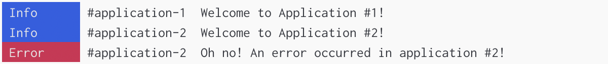

# Global Store

The **Global Store** is a global cache and control hub for your Adze logs. The primary purposes of a
GlobalStore are to enable global [configuration](../reference/configuration.md) overrides, log listeners,
and [tools](../reference/global-store.md#tools) for filtering and recalling your [cached](../reference/configuration.md#user-configuration) logs. To
see how a GlobalStore fits into the architecture, refer to the [Lifecycle Diagram](./introduction.md#lifecycle).

## How Does It Work?

One of the primary purposes of the Global Store is to enable large project to centrally control how
their logs render. Let's imagine we have a micro-frontend architecture where we have multiple
front-end applications running in the same browser context.


One of the major challenges with logging with microfrontends is that all of the applications share
the same runtime environment. This means that any logs that an application generates are mixed in
with logs generated by any of the other applications.

Debugging one of these apps would mean we would have to sort through a lot of logs that are not
applicable. In addition, there would normally be no easy way to configure the logging of these
applications centrally.

With the Adze Global Store you can easily configure all instances running in the same browser
context. Let's take a look at some code:

```typescript
import adze from 'adze';

adze.log('This is a log!');
```

This code looks pretty simple. We're just importing Adze and generating a single log. However,
behind the scenes, Adze will check if a **Global Store** exists, and if it doesn't exist it will
automatically instantiate an instance of it in the global context of your environment.

Here's where it will be created:

- `window.$adzeGlobal` - If your environment is a web browser / [deno](https://docs.deno.com/api/web/~/Window), the Global Store will be attached to the `window`.
- `global.$adzeGlobal` - If your environment is [node](https://nodejs.org/api/globals.html#global) / [bun](https://bun.sh/docs/api/globals), the Global Store will be attached to the `global` value.

The logs that are generated within your runtime context will take any configuration that is set on
the Global Store and merge it on top of its current configuration as an override.

What this means is that even if multiple applications generate logs, you can control all of the logs
by providing configuration to the Global Store.

## Using the Setup Function

Let's look at an example of overriding log configuration centrally using the Global Store with the
`setup()` function.

```typescript
import adze, { setup } from 'adze';

// By calling setup, we will instantiate the global store with some configuration overrides.
// We will restrict the active log level to info for everything in our runtime context.
setup({
  activeLevel: 'info',
  format: 'pretty',
});
```

Meanwhile... in microfrontend application #1...

```typescript
// mfe-application-1.ts
import adze from 'adze';

const logger = adze.format('json').ns('application-1').seal();

logger.info('Welcome to Application #1!');
logger.log('Something happened that I want to log about.', 123);
logger.debug('Some more details here...', { foo: 'bar' });
```

And in microfrontend application #2...

```typescript
// mfe-application-2.ts
import adze from 'adze';

const logger = adze.format('json').ns('application-2').seal();

logger.info('Welcome to Application #2!');
logger.error('Oh no! An error occurred in application #2!');
logger.debug('Logging some more details for debugging purposes.', { foo: 'bar' });
```

#### Browser Output


#### Server Output



---

Notice that in our example output that the [log](../reference/terminators.md#log) and
[debug](../reference/terminators.md#debug) logs are not rendering. This is because our store is
forcing their log level to only show up to [info](../reference/terminators.md#info) level. Also,
even though each application is defining the log format to use the [json format](../reference/formatters.md#json-formatter), the logs are
printing with the [pretty format](../reference/formatters.md#pretty-formatter) because the log configuration is overwritten by the global
configuration.
