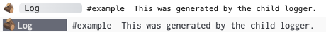

# Introduction

## Why is this named Adze?


_Illustration from [Wikipedia](https://en.wikipedia.org/wiki/Adze)_

> Adze - [a cutting tool that ... is used chiefly for shaping wood](https://www.merriam-webster.com/dictionary/adze).
>
> Pronounced as "adz"

Adze was chosen as a name for this library to maintain solidarity with the logging puns and to emphasize that this library is a tool for shaping the logs of your application.

<!-- ## Adze Demo

TODO: Redo the demo video

<div class="youtube-video-container">
  <iframe width="560" height="315"  src="https://www.youtube-nocookie.com/embed/8Ht3LKowKR0" title="YouTube video player" frameborder="0" allow="accelerometer; autoplay; clipboard-write; encrypted-media; gyroscope; picture-in-picture" allowfullscreen></iframe>
</div> -->

## Why should I use Adze?

:::tip
Adze is [**UNIVERSAL**](https://en.wikipedia.org/wiki/Isomorphic_JavaScript), meaning it can run in any JS runtime (node, bun, deno, browser) without any special considerations.
:::

Compared to existing Javascript logging libraries, Adze sets itself apart because it is **universal**, meaning **it can run in both server and browser environments with zero config**. Other libraries, such as Winston or Bunyan only support server environments. Libraries like Pino and Log4JS support both environments, but it either requires some configuration or it only provides you with a very limited feature set. None of them directly support Deno or Bun.

Javascript frameworks have been shifting to server-side rendering (SSR) and to micro-frontend style architectures. Both of these architecture approaches present unique challenges with logging in a production-ready environment. Because Adze is universal by nature, you can write your logs the same way throughout your application and **it will just work**.

Aside from universalism, Adze also offers many other compelling features:

- First-class [TypeScript](https://typescriptlang.org/) support (not bolted-on)
- Wraps and extends the entire [standard API](https://developer.mozilla.org/en-US/docs/Web/API/console)
- A convenient [chainable API](./concepts.md)
- [Log Listeners](./capture-data.md#log-listeners) for capturing log data
- [Middleware](../reference/middleware.md) support for [plugins](../plugins.md) and transporting logs
- [Log annotations](./annotation.md) such as [namespaces](../reference/modifiers.md#namespace--ns), [labels](../reference/modifiers.md#label), and other [meta data](../reference/modifiers.md#meta)
- Four formats supported out of the box:
  - [Pretty](../reference/formatters.md#pretty-formatter) - Human readable logs that are easy on the eyes
  - [JSON](../reference/formatters.md#json-formatter) - Machine readable logs that are compatible with the [Bunyan CLI](https://github.com/trentm/node-bunyan?tab=readme-ov-file#cli-usage)
  - [Standard](../reference/formatters.md#standard-formatter) - Human readable stdout logs
  - [Common](../reference/formatters.md#common-formatter) - Logs that adhere to the [Common Log Format](https://en.wikipedia.org/wiki/Common_Log_Format)
- Everything is customizable and configurable
- [Tools](../reference/tools.md) for caching, filtering, and recalling logs
- Support for creating [log threads](./threading.md) to track data across multiple scopes
- Convenient [child logger](../reference/terminators.md#seal) API's
- and much more...

### Here is a simple preview


:::details
This preview was generated from the same code executed in both the browser (left) and the server (right) environments.
:::

## What does the API look like?

As stated above, Adze offers an easy to use, chainable API. To create a log you simply chain together an Adze log instance with a series of modifiers and then end with a terminator. Here's an example of creating a log with a namespace:

```typescript
import adze from 'adze';

adze.namespace('example').log('Example log');
```

The output of this would look like the following:


### What about child loggers?

You might be asking yourself, "the chainable API looks nice, but how about creating reusable loggers
throughout my application?"

```typescript
// logger.ts
import adze from 'adze';

// Create a child logger where all logs generated include the "example" namespace and emoji styles.
export const logger = adze.withEmoji.namespace('example').seal();
```

```typescript
//- otherFile.ts
import { logger } from './logger.ts';

logger.log('This was generated by the child logger.');
```

The output of this would look like the following:


