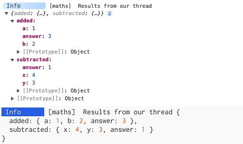

# Log Threading (MDC)

In large applications there are often times when we need to log data that comes from multiple
different scopes but we want to collect all of the data and print it in a single log.

This practice of collating data from many scopes is called [Mapped Diagnostic Context](https://www.baeldung.com/mdc-in-log4j-2-logback).
This is a common feature in Java's Log4J library.

Adze also supports [Mapped Diagnostic Context](https://www.baeldung.com/mdc-in-log4j-2-logback), or
as Adze calls it, **Log Threading**. Think of a log thread like a thread on a message board or
reddit where multiple individuals make a comment on a common topic.

Here is an example of how threads can be used with Adze:

```typescript
import adze from 'adze';

function add(a: number, b: number) {
  const answer = a + b;
  adze.label('maths').thread('added', { a, b, answer });
  return answer;
}

function subtract(x: number, y: number) {
  const answer = x - y;
  adze.label('maths').thread('subtracted', { x, y, answer });
  return answer;
}

add(1, 2);
subtract(4, 3);

adze.label('maths').dump.info('Results from our thread');
```

## Example Output



---

Notice that each log within the `add` and `subtract` functions does not actually generate a log, but
rather they add a key / value pair of data to the `"maths"` label thread.

On line 18, we create a log with the `"maths"` label, which provides it with the same context as the
other logs in the thread, and the `dump` modifier instructs the info log to dump the values from
the `"maths"` thread into the log output.

We now have a single log that contains values from multiple scopes in our application.
