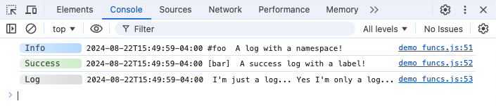
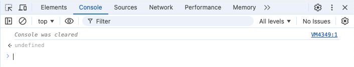

# Tools

Adze supports some tools for helping developers sift through logs that have been generated.

## Browser Tools

In browser environments, Adze will always generate a global store named `$adzeGlobal` on the
`window` object. From the adze global object you can access tools for filtering logs that have
been generated and cached.

Log caching is disabled by default and the number of logs that can be cached is capped at 300 by
default. You must enable log caching to take advantage of the browser tools. You can also raise or
lower the cache size as well.

```typescript
import adze, { setup } from 'adze';

// Enable log caching and raise the maximum cache size from the default of 300 to 500.
setup({
  cache: true,
  cacheSize: 500,
});

const logger = adze.timestamp.seal();
export default logger;
```

The filtering tools that are available are similar to the [configuration based filtering](./filtering.md)
in the previous section of this guide. The tools are as follows:

- **filterByNamespace** - Reprints logs that match the [namespace]() values provided.
- **filterByLabel** - Reprints logs that match the [label]() value provided.
- **filterByLevel** - Reprints logs that match the [LevelFilter]() value provided.

As an example, let's first write some basic logs to showcase the browser tools.

```typescript
import logger from './logger';

logger.ns('foo').info('A log with a namespace!');
logger.label('bar').success('A success log with a label!');
logger.log("I'm just a log... Yes I'm only a log...");
```

If we open up the developer console in a browser, we can see all of our Adze logs that were
generated when our web application executed.



Now, let's clear the logs. Type `console.clear()` in the developer tools console.



Now that the console has been cleared, let's use our tools to rerender all logs with a level of
`"log"`.


Our log that we generated earlier has now been rerendered from the log cache.

We can repeat this process for logs with **namespaces** and **labels** as well.

## Terminal Tools

When working with logs in a backend node environment, often times we write our logs to a file, much
like our example in the [Capturing Log Data - Middleware](./capture-data.md#middleware) section of
the guide.

It's very useful to use a [JSON log format](./setup.md#set-the-output-format) for machine readable
logs that are easy for programs to parse and consume. Other libraries, such as [Bunyan](https://github.com/trentm/node-bunyan)
are completely focused on JSON logging and do a great job with generating them.

Because of how well [Bunyan](https://github.com/trentm/node-bunyan) handles JSON logging, Adze JSON
logs are modeled to match the **Bunyan JSON format**. Because Adze does not reinvent the wheel here,
developers can take advantage of [Bunyan's handy CLI tool](https://github.com/trentm/node-bunyan?tab=readme-ov-file#cli-usage).

This tool can be used for parsing and filtering machine-readable JSON logs into human readable
formats. For more information on using the Bunyan CLI, please refer to the [Bunyan docs](https://github.com/trentm/node-bunyan?tab=readme-ov-file#cli-usage)
for setup and usage instructions.
