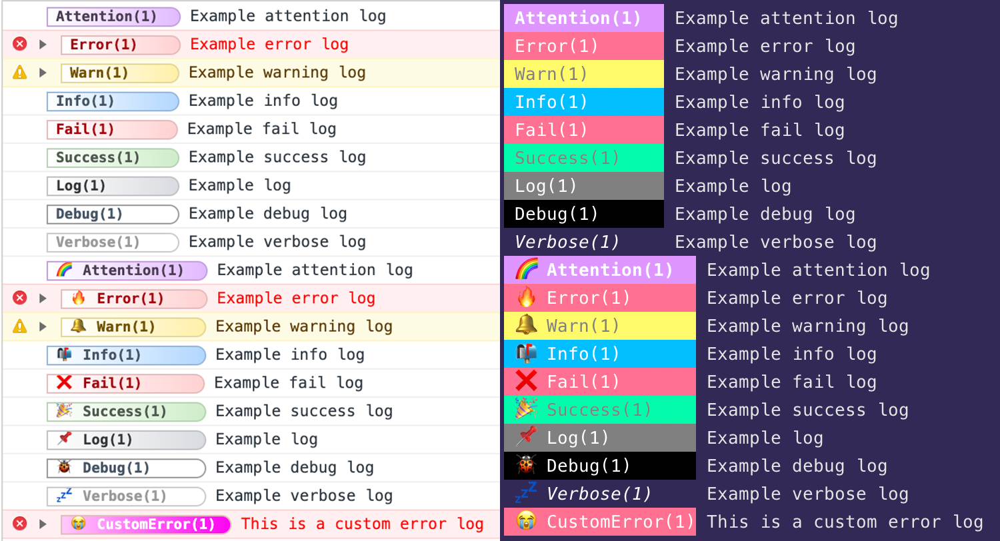

# Guide

## Why is this named Adze?


_Photo from [Wikipedia](https://en.wikipedia.org/wiki/Adze)_

> Adze - [a cutting tool that ... is used chiefly for shaping wood](https://www.merriam-webster.com/dictionary/adze).

Adze was chosen as a name for this library to maintain solidarity with the logging puns and to emphasize that this library is a tool for shaping the logs of your application.

## Why should I use Adze?

As you may already be aware there are a number of other good JS libraries out there to assist with logging. The focus of Adze is to provide a convenient and clean API, provide first-class TypeScript support, and to empower you to take command of your logs rather than pigeon-hole you into a specific way of handling them.

Here is a list of the features that Adze provides:

- First-class TypeScript support
- Runs in both the browser and node
- A fluent, chainable API for creating logs
- Log Listeners that empower you to do with your logs as you wish
- Annotate your logs with namespaces, labels, and other meta data
- Attractive styling (EMOJI'S INCLUDED)
- Everything is configurable
- Create custom log levels
- A global log store for recalling logs and overriding configuration

Beyond the new features that Adze provides you, it also wraps the entire console web standard.
Read more about the standard here: [MDN Console Docs](https://developer.mozilla.org/en-US/docs/Web/API/console)

### Here is a simple preview:



## What does the API look like?

As stated above, Adze offers an easy to use, chainable API. To create a log you simply chain together an Adze log instance with a series of modifiers and then end with a terminator. Here's an example of creating a log with emoji's and a namespace:

```typescript
import { adze } from 'adze';

adze({ use_emoji: true }).ns('tix-456').log('Example log');
```

The output of this would look like the following:


