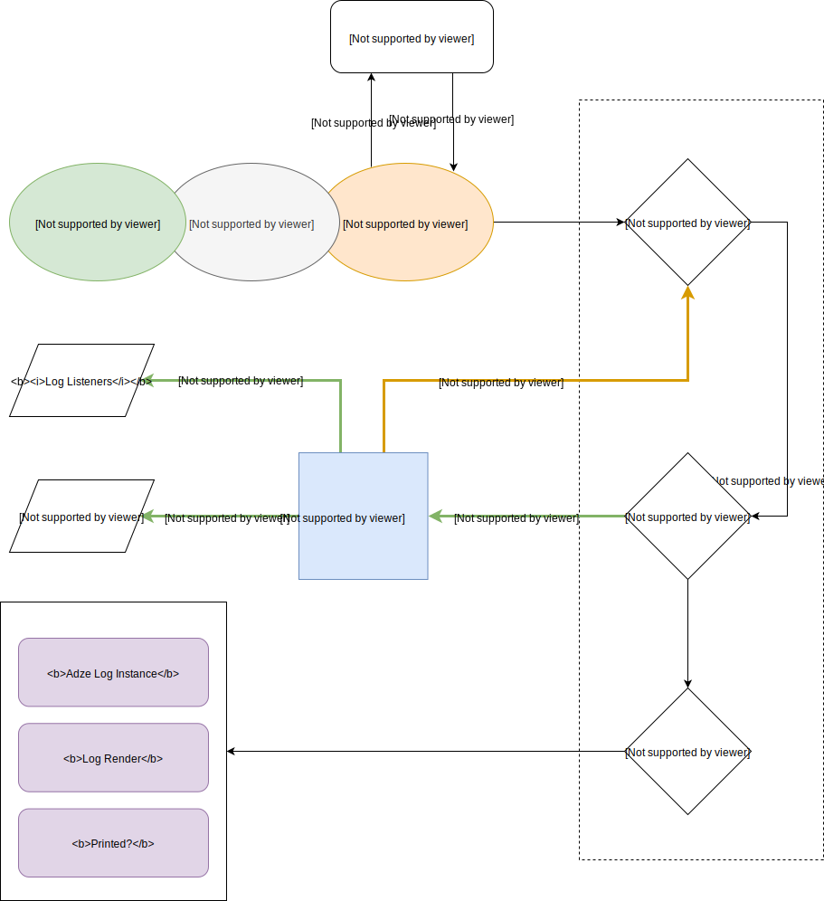
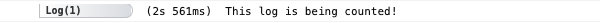

# Adze Concepts

Adze as a library has a few core goals it attempts to meet. The first goal is to provide an API that wraps, extends, or replicates all of the functionality of the standard [Console API](https://developer.mozilla.org/en-US/docs/Web/API/console). The standard console API allows you to create logs based on severity, however other utility logs like table, assert, trace, etc. are all tied to the severity of `log`. Adze takes a different approach by turning these into [modifiers](modifiers.md) which can be terminated by whichever severity level you prefer.

The second goal of the Adze project is to give you a natural log writing experience that doesn't feel too different from the standard. To make the experience of using Adze feel natural, Adze provides a chainable API that is similar to the standard `console.log()` API.

Lastly, most other libraries **do too much**. Adze seeks to separate concerns when it comes to generating logs and transporting them to another source. Other libraries tend to try to solve both problems, but over time what ends up occurring is that the library author isn't able to predict all of the different ways someone might want to transport their log data. This ends up creating a lot of bloat in the library. You end up with support for transports you may never use. The library's configuration also ends up becoming a mess to support all of these different transports.

Adze rejects the idea of coupling the log inputs with transport outputs which is why the core library only offers [listeners](shed-concepts.md#listeners) as a way of collecting log data. With access to the listeners the end user can harvest the desired data and do with it as they please. However, we also understand it's nice to have an out-of-the-box solution for transports. Over time we hope to provide some secondary packages that can be installed along side of Adze to provide some simple transport options.

## Lifecycle

Let's take a look under the hood to see how the Adze architecture enables its API.
_Please keep in mind this diagram is not exhaustive._



## The Log Chain

As you can see in the diagram, a log chain is made up of three parts:

- [Log Factory](factories.md)
  - This is a function that generates a log instance and returns it.
- [Modifiers](modifiers.md)
  - These log methods modify the instance and then return it.
- [Terminator](default-terminators.md)
  - These methods end the chain and finalize the log.

### Log Factory

Adze comes with a function named [`adze()`](factories.md#adze) out of the box. This function is
a [factory](factories.md) that creates a new Adze instance. Most of the time when interacting
with this library you will either use this factory directly or assign it to
a variable after calling [seal](factories.md#seal), but we'll come back to that later in the guide.

### Modifiers

Once you have an instance of Adze you can immediately [terminate](terminators) it, or you
can call certain methods that this library calls modifiers. Modifiers are
methods on an Adze log instance that changes its behavior. For example, if
you wanted to add a performance timestamp to your log you would use the
`timeNow` modifier.

```typescript
adze().timeNow.log('This is the time from pageload.');
```

And it would output like this:



### Terminator

In our [Modifiers](modifiers) example code above, you can see we ended our
chain with [`log()`](default-terminators.md#log). The log method is one of the eight [default log terminators](default-terminators.md).
The library also comes with [other special terminators](other-terminators.md) like
[custom](other-terminators.md#custom). A log method is considered a terminator when it
ends your log chain and returns a [terminated log object](data.md#terminated-log-object).

## Common Usage

Most of the time when you are using a logging library you will want to configure a logging instance once and then use it throughout your codebase. This is done with the [seal factory](factories.md#seal). When your configuration is sealed a new log factory is returned. All subsequent logs generated from that factory will inherit the configuration you sealed.

### Example

```javascript
// ----- setup.js ----- //
import { adze, createShed } from 'adze';

/* We'll create a Shed to enable labels and counting
   for our example. */
createShed();

// Let's create an Adze configuration
const cfg = {
  log_level: 1,
};

// Now we'll create a new factory using seal
export const log = adze(cfg).label('foo').count.seal();

// ----- elsewhere.js ----- //
import { log } from '~/setup.js';

// And now we can create new logs using our new factory
log().error('An error occurred! Oh no!');
log().error('Another error occurred! Quick! Help!');
log().log("I won't display because my log level is too high.");
```

### Output


## Filtering

One of the primary features of Adze is to allow you to filter your logs while developing and debugging. These filters are created within the optional [configuration](/config/#adze-configuration) that you provide Adze logs.

### Example

In our app's boot file (named `main.ts` for our example) we'll create a [Shed](shed-concepts.md) for [listening](shed-concepts.md#listeners) to our logs and we'll configure our adze factory with some [filters](/config/#filters) that we'll [seal](modifiers.md#seal) into a new factory named `log`.

```javascript
// Main.ts
import { adze, createShed } from 'adze';

// Generate our shed for listening to our logs
const shed = createShed();

// Let's use the shed instance reference to add a log listener.
shed.addListener('*', (data, render) => {
  // Render will be null if the log was never written to the console.
  if (render) {
    // do something with data
  }
});

/* Let's create an Adze configuration with some filters. In a real-world environment
   you would import this configuration from a environment file. */
const cfg = {
  filters: {
    namespace: {
      exclude: ['new-feature'],
    },
  },
};

// Now we'll seal our configuration into a new factory named log
export const log = adze(cfg).seal();

// Doing some boot stuff...
```

Now, elsewhere in our codebase we'll import our `log` factory for creating new logs.

```javascript
// ----- MyNewFeature.ts -----
// Import our log factory
import { log } from './main.ts';

function myNewFeature() {
  // ns() is an alias for namespace()
  log().ns('new-feature').debug('Staring to run myNewFeature');
  // Do some logic for our new feature...
  log().ns('new-feature').log('Dumping a value in our code', X);
  // Do some more logic...
  log().ns('new-feature').success('Completed execution of myNewFeature!');
}
```

The code above will exclude any logs with a namespace of "new-feature" from being written to the console. Also take notice of the listener we created in our `main.ts`. It watches all log levels (represented by the `'*'`) and will fire for the logs with a namespace of `'new-feature'` even though they are being filtered out. This is done to give you flexibility in how you want to handle your logs in your listeners.

Also notice in our code we are checking if the render value is truthy. We are doing this because any log that was not written to the console will have a `null` log render. This is an easy way to ignore logs that are hidden by any of our filters.
