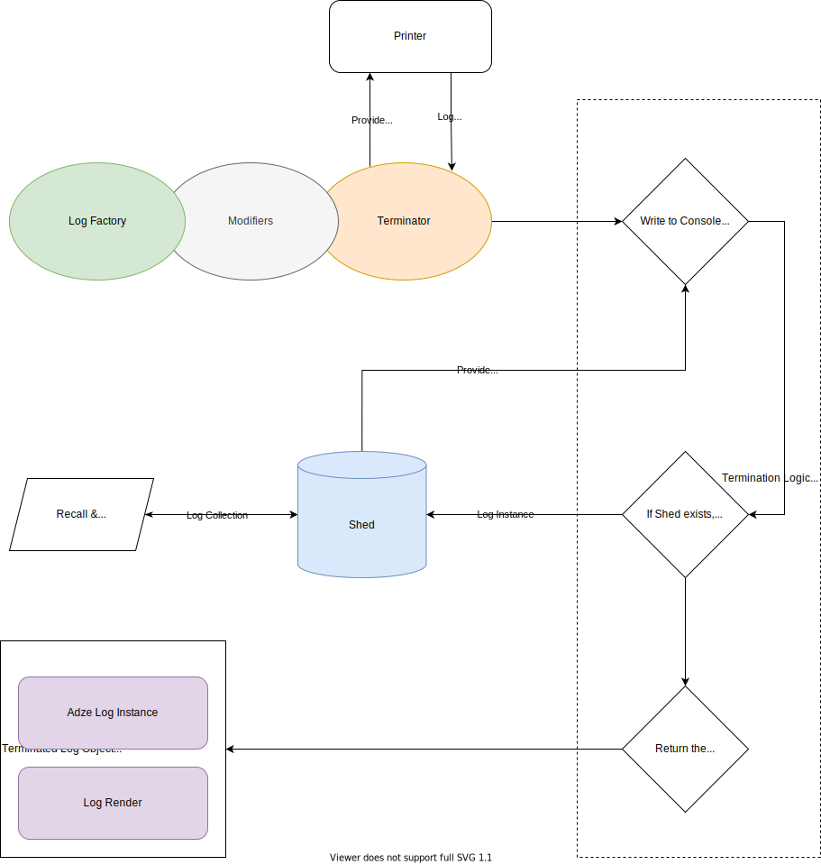

# Adze Concepts

One of the core goals of the Adze project is to give you, the developer,
full control over all aspects of your logging while also making the experience
of writing your logs feel natural. To make the experience of using Adze feel
natural, Adze provides a chainable API. Let's look at a basic lifecycle diagram
of the library _(please keep in mind this is not an exhaustive diagram)_.

## Lifecycle



## The Log Chain

As you can see in the diagram, a log chain is made up of three parts:

- Log Factory
  - This is a function that generates a log instance and returns it.
- Modifiers
  - These log methods modify the instance and then return it.
- Terminator
  - These methods end the chain and finalize the log.

### Log Factory

Adze comes with a function named `adze()` out-of-the-box. This function is
a factory that creates a new Adze instance. Most of the time when interacting
with this library you will either use this factory directly or assign it to
a variable after calling `seal()`, but we'll come back to that later.

### Modifiers

Once you have an instance of Adze you can immediately terminate it, or you
can call certain methods that this library calls modifiers. Modifiers are
methods on an Adze log instance that changes its behavior. For example, if
you wanted to add a performance timestamp to your log you would use the
`timeNow` modifier.

```typescript
adze().timeNow.log('This log is being counted!');
```

And it would output like this:


### Terminator

In our [Modifiers](#modifiers) example code above, you can see we ended our
chain with `log()`. The log method is one of the eight default log terminators.
The library also comes with other special terminators like `custom()` for example.
What makes a log method considered a terminator is that it ends your log chain and
returns a **Terminated Log** object.

## Terminated Log Object

After an Adze log has been terminated a Terminated Log object will be returned (with
a couple of exceptions, like `clear()`). A terminated log object consists of two parts,
the **Log Instance** and the **Log Render**.

### Log Instance

This is the reference to the instance that was terminated. You can use this to get meta
data about the Log (refer to the `log.data()` method) or get a collection of logs if the
log was [bundled](#add-me-later).

### Log Render

The log render is a tuple in the form of `[method, args]` where you can re-render your
log exactly how the Adze log instance rendered it. Here is an example of how to use a
log render:

```typescript
// Let's generate a log and get its render
const { render } = adze().info('This is an info log');
// Then we will destructure the log to get the method and arguments
const [method, args] = render;
// And now we can re-render the log by calling the console method and spreading the args
console[method](...args);
```
