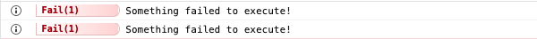

# Filtering & Utility Functions

When working with Adze logs sometimes you may have a [Collection](advanced.md#collections) of logs that you would like to filter down to a specific subset. Adze provides you with some filtering functions out of the box to help with this. Adze also provides a couple utility functions that are explained below.

## filterCollection

This function provides a generic way of filtering [collections](advanced.md#collections). The provided callback function receives a [log data object](data.md#log-data) for each log in the collection. If a truthy value is returned the current log of the iteration will be added into a new collection. If a falsy value is returned it will be omitted.

### Interface

```typescript
function filterCollection(
  collection: Collection,
  cb: (log: LogData) => boolean
): Collection;
```

### Example

```javascript
import { adze, bundle, filterCollection, rerender } from 'adze';

// Let's create a bundle so we can collect our logs
const bundled = bundle(adze({ use_emoji: true }));

bundled().ns('foo').error('This is an error!');
bundled().label('bar').info('This is some info.');
bundled().ns('baz').success('Successfully did something!');
const { log } = bundled().label('baz').log('Logging something.');

// Let's get our collection from the bundle
const collection = log.bundle;

/* Let's filter the collection by logs with namespace of 
  'foo' or labels of 'bar' and then re-render it. */
filterCollection(collection, (data) => {
  return data.namespace?.includes('foo') || data.label?.name === 'bar';
}).forEach(rerender);
```

### Output

In these example's of the output we can see our initial four logs and then the logs with a namespace of `'foo'` or a label of `'bar'` are re-rendered.


## filterLabel

Filters a [collection](advanced.md#collections) of logs by the given [label](modifiers.md#label).

### Interface

```typescript
function filterLabel(collection: Collection = [], label: string): Collection;
```

### Example

```javascript
import { adze, bundle, filterLabel, rerender } from 'adze';

// Let's create a bundle so we can collect our logs
const bundled = bundle(adze({ use_emoji: true }));

bundled().label('foo').error('This is an error!');
bundled().label('bar').info('This is some info.');
bundled().label('baz').success('Successfully did something!');
const { log } = bundled().label('baz').log('Logging something.');

// Let's get our collection from the bundle
const collection = log.bundle;

// Let's filter the collection and then re-render it.
filterLabel(collection, 'bar').forEach(rerender);
```

### Output

In these example's of the output we can see our initial four logs and then the log with a label of `'bar'` is re-rendered.


## filterLevel

Filters a [collection](advanced.md#collections) of logs by the given [level filter](#addmelater).

### Interface

```typescript
function filterLevel(
  collection: Collection = [],
  levels: LevelFilter
): Collection;
```

### Example

```javascript
import { adze, bundle, filterLevel, rerender } from 'adze';

// Let's create a bundle so we can collect our logs
const bundled = bundle(adze({ use_emoji: true }));

bundled().error('This is an error!');
bundled().info('This is some info.');
bundled().success('Successfully did something!');
const { log } = bundled().log('Logging something.');

// Let's get our collection from the bundle
const collection = log.bundle;

// Let's filter the collection and then re-render it.
filterLevel(collection, '0-3').forEach(rerender);
```

### Output

In these example's of the output we can see our initial four logs and then the logs with a level of in the range of 0 - 3 are re-rendered.


## filterNamespace

Filters a [collection](advanced.md#collections) of logs by the given [namespace](modifiers.md#namespace-ns).

### Interface

```typescript
function filterNamespace(collection: Collection = [], ns: string[]): Collection;
```

### Example

```javascript
import { adze, bundle, filterNamespace, rerender } from 'adze';

// Let's create a bundle so we can collect our logs
const bundled = bundle(adze({ use_emoji: true }));

bundled().ns('bar').error('This is an error!');
bundled().ns(['foo', 'bar']).info('This is some info.');
bundled().ns('baz').success('Successfully did something!');
const { log } = bundled().ns('baz').log('Logging something.');

// Let's get our collection from the bundle
const collection = log.bundle;

// Let's filter the collection and then re-render it.
filterNamespace(collection, ['bar']).forEach(rerender);
```

### Output

In these example's of the output we can see our initial four logs and then the logs with a namespace of `'bar'` are re-rendered.


## render

This utility function accepts a [log render](adze-concepts.md#log-render) and prints it to the console / terminal.

### Interface

```typescript
function render([method, args]: LogRender): void;
```

### Example

```javascript
import { adze, render } from 'adze';

/* Let's get our log render tuple and rename it as to
   not conflict with our function name */
const { render: logRender } = adze().success(
  'Something executed successfully!'
);

// Now we'll render our log render tuple
render(logRender);
```

### Output


## rerender

This utility function accepts a log instance and if it has been previously rendered this rerenders it. This function is often used in conjunction with a filter function like [filterLevel](#filterlevel).

### Interface

```typescript
function rerender(log: Log): void;
```

### Example

```javascript
import { adze, rerender } from 'adze';

const { log } = adze().fail('Something failed to execute!');
const { log: silentLog } = adze().silent.alert(
  'Alerting that something went horribly wrong!'
);

// Let's rerender our fail log
rerender(log);
// Our alert log will not rerender because it was silent and not previously rendered
rerender(silentLog);
```

### Output




