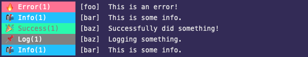

# Filtering & Utility Functions

When working with Adze logs sometimes you may have a [Collection](advanced.md#collections) of logs that you would like to filter down to a specific subset. Adze provides you with some filtering functions out of the box to help with this. Adze also provides a couple utility functions that are explained below.

## filterNamespace

Filters a [collection](advanced.md#collections) of logs by the given [namespace](modifiers.md#namespace-ns).

### Interface

```typescript
function filterNamespace(collection: Collection = [], ns: string[]): Collection;
```

### Example

```javascript
import { adze, bundle, filterNamespace, rerender } from 'adze';

// Let's create a bundle so we can collect our logs
const bundled = bundle(adze({ use_emoji: true }));

bundled().ns('bar').error('This is an error!');
bundled().ns(['foo', 'bar']).info('This is some info.');
bundled().ns('baz').success('Successfully did something!');
const { log } = bundled().ns('baz').log('Logging something.');

// Let's get our collection from the bundle
const collection = log.bundle;

// Let's filter the collection and then re-render it.
filterNamespace(collection, ['bar']).forEach(rerender);
```

### Output

In these example's of the output we can see our initial four logs and then the logs with a namespace of `'bar'` re-rendered.


## filterLabel

Filters a [collection](advanced.md#collections) of logs by the given [label](modifiers.md#label).

### Interface

```typescript
function filterLabel(collection: Collection = [], label: string): Collection;
```

### Example

```javascript
import { adze, bundle, filterLabel, rerender } from 'adze';

// Let's create a bundle so we can collect our logs
const bundled = bundle(adze({ use_emoji: true }));

bundled().label('foo').error('This is an error!');
bundled().label('bar').info('This is some info.');
bundled().label('baz').success('Successfully did something!');
const { log } = bundled().label('baz').log('Logging something.');

// Let's get our collection from the bundle
const collection = log.bundle;

// Let's filter the collection and then re-render it.
filterLabel(collection, 'bar').forEach(rerender);
```

### Output

In these example's of the output we can see our initial four logs and then the log with a label of `'bar'` re-rendered.




## filterLevels

Filters a [collection](advanced.md#collections) of logs by the given range of log levels.

### Interface

```typescript
function filterLabel(collection: Collection = [], label: string): Collection;
```

### Example

```javascript
import { adze, bundle, filterLabel, rerender } from 'adze';

// Let's create a bundle so we can collect our logs
const bundled = bundle(adze({ use_emoji: true }));

bundled().label('foo').error('This is an error!');
bundled().label('bar').info('This is some info.');
bundled().label('baz').success('Successfully did something!');
const { log } = bundled().label('baz').log('Logging something.');

// Let's get our collection from the bundle
const collection = log.bundle;

// Let's filter the collection and then re-render it.
filterLabel(collection, 'bar').forEach(rerender);
```

### Output

In these example's of the output we can see our initial four logs and then the log with a label of `'bar'` re-rendered.


