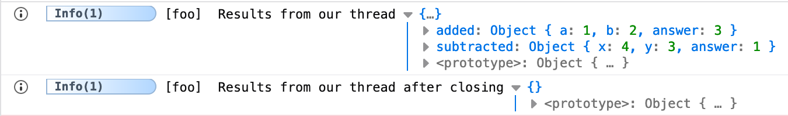
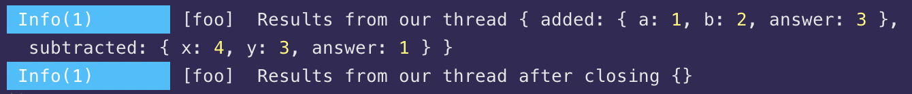

# Mapped Diagnostic Context (MDC)

## What is Mapped Diagnostic Context?

_"The basic idea of Mapped Diagnostic Context is to provide a way to enrich log messages with pieces of information that could be not available in the scope where the logging actually occurs, but that can be useful to better track the execution of the program."_

> Quote from [https://www.baeldung.com/mdc-in-log4j-2-logback](https://www.baeldung.com/mdc-in-log4j-2-logback)

Adze provides a way to use an MDC pattern through the combination of a few of it's API's such as [Shed](shed-concepts.md), [label](modifiers.md#label), and [thread](other-terminators.md#thread). We can also print our context using [dump](modifiers.md#dump) or clear our context using [close](modifiers.md#close).

## Example

```javascript
import { adze, createShed } from 'adze';

const shed = createShed();

shed.addListener('*', (data, render) => {
  // We can capture our MDC thread data from the log data object.
  const context = data.context;
});

function add(a, b) {
  const answer = a + b;
  adze().label('foo').thread('added', { a, b, answer });
  return answer;
}

function subtract(x, y) {
  const answer = x - y;
  adze().label('foo').thread('subtracted', { x, y, answer });
  return answer;
}

add(1, 2);
subtract(4, 3);

adze().label('foo').dump.info('Results from our thread');

adze().label('foo').close();

adze().label('foo').dump.info('Results from our thread after closing');
```

## Output




