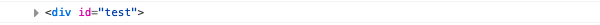
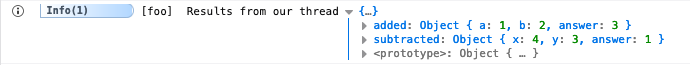
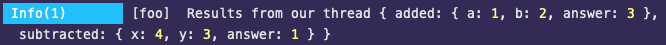
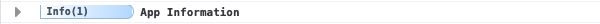
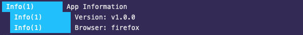
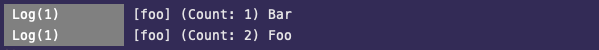

# Modifiers

Once you have an Adze log instance you can now start applying modifiers. Modifiers are methods that alter the log in some way and then return
the log instance so that you may chain more modifiers or terminate the instance. Keep in mind, some modifiers have a dependency on the presence of a [label](#label) and labels rely on Shed.

## assert

This modifier accepts an assertion boolean expression and will only print if the boolean expression fails (is a falsy value).

[**MDN Docs**](https://developer.mozilla.org/en-US/docs/Web/API/Console/assert)

### Interface

```typescript
class BaseLog {
  public assert(assertion: boolean): this;
}
```

### Example

```javascript
import { adze } from 'adze';

const x = 2;
const y = 3;

// Let's assert that x and y should be equal
adze()
  .assert(x === y)
  .log('X does not equal Y');

// This log will not print because the assertion passes
adze()
  .assert(x === 2)
  .log('X does not equal 2');

// Let's look at the output with emoji's enabled
adze({ useEmoji: true })
  .assert(x === y)
  .log('X does not equal Y');
```

### Output


## count

The count modifier tells the log to increment a counter associated to the log's [label](#label).

[**MDN Docs**](https://developer.mozilla.org/en-US/docs/Web/API/Console/count)

### Interface

```typescript
class BaseLog {
  public get count(): this;
}
```

### Example

```javascript
import { adze, createShed } from 'adze';

// A shed is required for labels and modifiers that depend on them
createShed();

for (let i = 0; i < 5; i += 1) {
  adze().label('my-counter').count.log('Counting iterations.');
}
```

### Output


## countClear

The countClear modifier completely clears the count from a [label](#label). Rather than setting the count to 0 it instead becomes null.

_NOTE:_
This method is deliberately a modifier rather than a terminator because it forces you to write a log that gives you insight into when a counter was cleared. It also makes the countClear log recallable from a [bundle](#bundle) or the [Shed](/guide/shed) in the order it was created.

_This is not a standard API._

### Interface

```typescript
class BaseLog {
  public get countClear(): this;
}
```

### Example

```javascript
import { adze, createShed } from 'adze';

// A shed is required for labels and modifiers that depend on them
createShed();

for (let i = 0; i < 4; i += 1) {
  adze().label('my-counter').count.log('Counting iterations.');
}

adze().label('my-counter').countClear.log('Clearing the counter.');

adze().label('my-counter').log('A log with the my-counter label but no count.');
```

### Output


## countReset

The countReset modifier resets the counter associated to the log's [label](#label) to 0.

_NOTE:_
This method is deliberately a modifier rather than a terminator because it forces you to write a log that gives you insight into when a counter was reset. It also makes the countReset log recallable from a [bundle](#bundle) or the [Shed](/guide/shed) in the order it was created.

[**MDN Docs**](https://developer.mozilla.org/en-US/docs/Web/API/Console/countReset)

### Interface

```typescript
class BaseLog {
  public get countReset(): this;
}
```

### Example

```javascript
import { adze, createShed } from 'adze';

// A shed is required for labels and modifiers that depend on them
createShed();

for (let i = 0; i < 4; i += 1) {
  adze().label('my-counter').count.log('Counting iterations.');
}

adze().label('my-counter').countReset.log('Resetting the counter.');

for (let i = 0; i < 4; i += 1) {
  adze().label('my-counter').count.log('Counting iterations again.');
}
```

### Output


## dir

The dir modifier transforms the output of the log by directing it to use the `console.dir()` method for printing purposes only.

_NOTE:_ Logs that use `dir` as a modifier should only be given a single argument which is usually an object. If multiple arguments are given, behavior may differ between browser and node environments. Refer to the MDN docs for more details.

[**MDN Docs**](https://developer.mozilla.org/en-US/docs/Web/API/Console/dir)

### Interface

```typescript
class BaseLog {
  public get dir(): this;
}
```

### Example

```javascript
import { adze } from 'adze';

adze().dir.log({ foo: 'bar' });
```

### Output


## dirxml

The dirxml modifier transforms the output of the log by directing it to use the `console.dirxml()` method for printing purposes only. This is mainly useful for logging out DOM elements.

_NOTE:_ Logs that use `dirxml` as a modifier should only be given a single argument which is usually a DOM Element or other XML object. If multiple arguments are given, behavior may differ between browser and node environments. Refer to the MDN docs for more details.

[**MDN Docs**](https://developer.mozilla.org/en-US/docs/Web/API/Console/dirxml)

### Interface

```typescript
class BaseLog {
  public get dirxml(): this;
}
```

### Example

```javascript
import { adze } from 'adze';

// create a new div element
const newDiv = document.createElement('div');
newDiv.setAttribute('id', 'test');
// and give it some content
const newContent = document.createTextNode('Hi there and greetings!');
// add the text node to the newly created div
newDiv.appendChild(newContent);

adze().dirxml.log(newDiv);
```

### Output




## dump

This modifier instructs the [labeled](#label) log to print the context values from a [thread](#thread).

Refer to the [Mapped Diagnostic Context (MDC)](mapped-diagnostic-context.md) page for more information about the purpose of MDC.

This modifier is dependent upon having a [label](#label) and a [Shed](./shed.md).

_This is not a standard API._

### Interface

```typescript
class BaseLog {
  public get dump(): this;
}
```

### Example

```javascript
import { adze, createShed } from 'adze';

const shed = createShed();

// Creating a shed listener is a great way to get meta data from your
// threaded logs to write to disk or pass to another plugin, library,
// or service.
shed.addListener([1, 2, 3, 4, 5, 6, 7, 8], (log) => {
  // Do something with `log.context.added` or `log.context.subtracted`.
});

function add(a, b) {
  const answer = a + b;
  adze().label('foo').thread('added', { a, b, answer });
  return answer;
}

function subtract(x, y) {
  const answer = x - y;
  adze().label('foo').thread('subtracted', { x, y, answer });
  return answer;
}

add(1, 2);
subtract(4, 3);

adze().label('foo').dump.info('Results from our thread');
```

### Output





## group

The group modifier starts an uncollapsed group of logs. This means that all subsequent logs will be nested beneath this log until a [groupEnd](#groupEnd) log occurs.

[**MDN Docs**](https://developer.mozilla.org/en-US/docs/Web/API/Console/group)

### Interface

```typescript
class BaseLog {
  public get group(): this;
}
```

### Example

```javascript
import { adze } from 'adze';

// Some info about our app.
const version = 'v1.0.0';
const browser = 'firefox';

adze().group.info('App Information');
adze().info(`Version: ${version}`);
adze().info(`Browser: ${browser}`);
adze().groupEnd.info();
```

### Output


## groupCollapsed

The groupCollapsed modifier starts an collapsed group of logs. This means that all subsequent logs will be nested beneath this log until a [groupEnd](#groupEnd) log occurs.

_Note:_ This will not be collapsed in a terminal environment since there is no way to uncollapse it.

[**MDN Docs**](1)

### Interface

```typescript
class BaseLog {
  public get groupCollapsed(): this;
}
```

### Example

```javascript
import { adze } from 'adze';

// Some info about our app.
const version = 'v1.0.0';
const browser = 'firefox';

adze().groupCollapsed.info('App Information');
adze().info(`Version: ${version}`);
adze().info(`Browser: ${browser}`);
adze().groupEnd.info();
```

### Output





## groupEnd

The groupEnd modifier ends a log group. Any logs following a groupEnd will no longer be grouped.

[**MDN Docs**](https://developer.mozilla.org/en-US/docs/Web/API/Console/groupEnd)

### Interface

```typescript
class BaseLog {
  public get groupEnd(): this;
}
```

### Example

```javascript
import { adze } from 'adze';

// Some info about our app.
const version = 'v1.0.0';
const browser = 'firefox';

adze().group.info('App Information');
adze().info(`Version: ${version}`);
adze().info(`Browser: ${browser}`);
adze().groupEnd.info(); // <-- Ends the group

adze().info('Some other information...');
```

### Output


## label

Applies an identifying label to a log. If a [Shed](../shed.md) is present, all logs that share the same label will be linked together behind the scenes. This enables global tracking for modifiers that require a label as a prerequisite.

These are the modifiers that require a label and a [Shed](../shed.md) to be useful:

- [count](#count)
- [countReset](#countreset)
- [countClear](#countclear)
- [time](#time)
- [timeNow](#timenow)
- [timeEnd](#timeend)

_This is not a standard API._

### Interface

```typescript
class BaseLog {
  public label(name: string): this;
}
```

### Example

```javascript
import { adze, createShed } from 'adze';

createShed();

// Labels can be applied in any order in a modifier chain
adze().count.label('foo').log('Bar');
adze().label('foo').count.log('Foo');
```

### Output




## meta

The meta modifier allows you to attach meta data to your log instance. You can then retrieve it at a later time from within a log listener or by calling the `data()` method on a log instance.

_This is not a standard API._

### Interface

```typescript
class BaseLog {
  public meta<T>(key: string, value: T): this;
}
```

### Example

```javascript
import { adze, createShed } from 'adze';

// Let's optionally create a shed to show the use of meta data on listeners
const shed = createShed();

// We'll listen only to logs of level 6 which is "log"
shed.addListener([6], (data) => {
  adze().info("My log's meta data!", data.meta);
});

// Let's create a super important message to attach as meta data
const info = 'Hello World!';

adze().meta('message', info).log('This log contains an important message.');
```

### Output


## namespace / ns

This modifier adds one or more namespaces to a log. These are mainly used as human
readable group identifiers but are also useful for filtering recalled logs and for identifying logs from a log listener. This modifier does not do any special grouping under the hood.

_This is not a standard API._

### Interface

```typescript
class BaseLog {
  public namespace(ns: string | string[]): this;
}
```

### Example

```javascript
import { adze } from 'adze';

adze().namespace('tix-123').log('Important info for a feature.');
adze()
  .namespace(['tix-123', 'tix-456'])
  .log('Important info for multiple features.');
// ns() is a shorthand alias for namespace()
adze().ns('tix-456').log('More info');
```

### Output


## silent

The silent modifier allows a log to be terminated and cached but prevents it from printing to the console. This can be useful for providing a log to a log listener that you do not want to have printed.

_This is not a standard API._

### Interface

```typescript
class BaseLog {
  public get silent(): this;
}
```

### Example

```javascript
import { adze } from 'adze';

adze().log('Hello World!');
adze().silent.log('Crickets...');
adze().log('I guess nobody is home :(');
```

### Output


## table

The table modifier transforms the output of the log by directing it to use the `console.table()` method for printing purposes only.

[**MDN Docs**](https://developer.mozilla.org/en-US/docs/Web/API/Console/table)

### Interface

```typescript
class BaseLog {
  public get table(): this;
}
```

### Example

```javascript
import { adze } from 'adze';

const tabular_data = [
  { firstName: 'Andrew', lastName: 'Stacy' },
  { firstName: 'Jim', lastName: 'Bob' },
];

adze().table.log(tabular_data);
```

### Output


## test

This modifier accepts a boolean expression and will only print if the boolean expression passes (is a truthy value).

_This is not a standard API._

### Interface

```typescript
class BaseLog {
  public test(expression: boolean): this;
}
```

### Example

```javascript
import { adze } from 'adze';

const x = 2;
const y = 3;

// Let's test that x equals 2
adze()
  .test(x === 2)
  .log('X equals 2');

// This log will not print because the test fails
adze()
  .test(x === y)
  .log('X does not equal Y');

// Let's look at the output with emoji's enabled
adze({ useEmoji: true })
  .test(y === 3)
  .log('Y equals 3');
```

### Output


## time

This modifier starts a timer associated to the log's [label](#label). This is useful for taking performance measurements. A log with a time modifier must be followed by a log with a [timeEnd](#timeend) modifier in order to get the final measurement.

This modifier is dependent upon having a [label](#label) and a [Shed](./shed.md).

[**MDN Docs**](https://developer.mozilla.org/en-US/docs/Web/API/Console/time)

### Interface

```typescript
class BaseLog {
  public get time(): this;
}
```

### Example

```javascript
import { adze, createShed } from 'adze';

createShed();

// Let's create a timer for performance
adze().label('loop').time.log('Starting a timer.');

for (let i = 0; i < 10000; i += 1) {
  // Do a lot of stuff that takes time
}

// End the timer to get the loop performance
adze().label('loop').timeEnd.log('Performance of our loop.');

// Let's see the output with emoji's
adze({ useEmoji: true }).label('loop').timeEnd.log('Performance of our loop.');
```

### Output


## timeEnd

This modifier ends a timer associated to the log's [label](#label). This is useful for taking performance measurements. A log with a timeEnd modifier must be preceded by a log with a [time](#time) modifier in order to get the final measurement.

This modifier is dependent upon having a [label](#label) and a [Shed](./shed.md).

[**MDN Docs**](https://developer.mozilla.org/en-US/docs/Web/API/Console/timeEnd)

### Interface

```typescript
class BaseLog {
  public get time(): this;
}
```

### Example

```javascript
import { adze, createShed } from 'adze';

createShed();

// Let's create a timer for performance
adze().label('loop').time.log('Starting a timer.');

for (let i = 0; i < 10000; i += 1) {
  // Do a lot of stuff that takes time
}

// End the timer to get the loop performance
adze().label('loop').timeEnd.log('Performance of our loop.');

// Let's see the output with emoji's
adze({ useEmoji: true }).label('loop').timeEnd.log('Performance of our loop.');
```

### Output


## timeNow

This modifier logs the time ellapsed since the page has loaded. This is useful for measuring page load performance rather than performance of a particular piece of code. This modifier is **not** dependent upon a [label](#label) or [Shed](./shed.md).

If a [label](#label) and a [Shed](./shed.md) exist, this modifier will record it's timestamp to the label.

_This is not a standard API._

### Interface

```typescript
class BaseLog {
  public get timeNow(): this;
}
```

### Example

```javascript
import { adze } from 'adze';

for (let i = 0; i < 10000; i += 1) {
  // Do a lot of stuff that takes time
}

// Let's create a timer for performance
adze().timeNow.log('Recording the time ellapsed since page load.');

// Let's see what it looks like with emoji's enabled.
adze({ useEmoji: true }).timeNow.log(
  'Recording the time ellapsed since page load.'
);
```

### Output


## timestamp

This modifier instructs the log to render an [ISO 8601](https://en.wikipedia.org/wiki/ISO_8601) timestamp.

_This is not a standard API._

> Version >= 1.1

### Interface

```typescript
class BaseLog {
  public get timestamp(): this;
}
```

### Example

```javascript
import { adze } from 'adze';

adze().label('timestamped').timestamp.log('This log has a timestamp.');
```

### Output


## trace

This modifier instructs the log to print a stacktrace using the standard `console.trace()` method.

_NOTE:_ The styling for logs using this modifier varies by browser. Chrome will render the log message with proper styling while Firefox will only render the message unstyled.

[**MDN Docs**](https://developer.mozilla.org/en-US/docs/Web/API/Console/trace)

### Interface

```typescript
class BaseLog {
  public get trace(): this;
}
```

### Example

```javascript
import { adze } from 'adze';

adze().trace.log('Trying to find an issue...');
```

### Output


