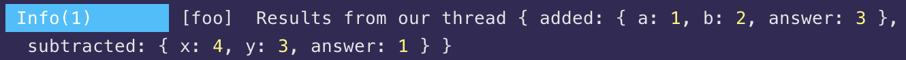

# Other Terminators

Aside from the [default terminator methods](default-terminators.md), Adze also exposes a few others for different utility purposes.

## clear / clr

This terminator simply exists as an alias for `console.clear()`.

**MDN Docs:** [https://developer.mozilla.org/en-US/docs/Web/API/Console/clear](https://developer.mozilla.org/en-US/docs/Web/API/Console/clear)

### Interface

```typescript
class BaseLog {
  public clear(): void;
  public clr(): void;
}
```

### Example

```javascript
import { adze } from 'adze';

adze().log('This is a log I want to clear.');

adze().clear();
```

### Output

The output for this is a blank dev tools console / terminal.

## close

Closes a [thread](#thread) assigned to the log by clearing the context values.

_This is not a standard API._

### Interface

```typescript
class BaseLog {
  public close(): void;
}
```

### Example

```javascript
import { adze, createShed } from 'adze';

const shed = createShed();

function add(a, b) {
  const answer = a + b;
  adze().label('foo').thread('added', { a, b, answer });
  return answer;
}

function subtract(x, y) {
  const answer = x - y;
  adze().label('foo').thread('subtracted', { x, y, answer });
  return answer;
}

add(1, 2);
subtract(4, 3);

adze().label('foo').dump.info('Results from our thread');

adze().label('foo').close();

adze().label('foo').dump.info('Results from our thread after closing');
```

### Output


## custom

Terminates the log at the provided custom log level. Custom log levels are defined within the Adze configuration object under the [`custom_levels`](configuration.html#customlevels) property.

[Configuration Details](configuration.html#customlevels)

_This is not a standard API._

### Interface

```typescript
class BaseLog {
  public custom(level_name: string, ...args: unknown[]): TerminatedLog<this>;
}
```

### Example

```javascript
import { adze } from 'adze';

// Create our Adze configuration
const cfg = {
  log_level: Infinity,
  use_emoji: true,
  custom_levels: {
    leetLevel: {
      level: 1337,
      method: 'log',
      style:
        'font-size: 10px; font-weight: bold; border-radius: 0 10px 10px 0; border-width: 1px; border-style: solid; padding-right: 40px; ',
      terminal: ['white', 'bgBlue'],
      emoji: '👾',
    },
  },
};

// Use the configuration and write a custom log
adze(cfg).custom('leetLevel', 'This log is leet.');
```

### Output


## thread

Following the MDC (Mapped Diagnostic Context) pattern, this method enables you to create a thread for adding context from different scopes before finally terminating the log.

In order to create a thread, this log must specify a [label](modifiers.md#label) that will be used to link the context and your environment must have a [Shed](shed-concepts.md) created.

_This is not a standard API._

### Interface

```typescript
class BaseLog {
  public thread<T>(key: string, value: T): void;
}
```

### Example

```javascript
import { adze, createShed } from 'adze';

const shed = createShed();

// Creating a shed listener is a great way to get meta data from your
// threaded logs to write to disk or pass to another plugin, library,
// or service.
shed.addListener([1, 2, 3, 4, 5, 6, 7, 8], (log) => {
  // Do something with `log.context.added` or `log.context.subtracted`.
});

function add(a, b) {
  const answer = a + b;
  adze().label('foo').thread('added', { a, b, answer });
  return answer;
}

function subtract(x, y) {
  const answer = x - y;
  adze().label('foo').thread('subtracted', { x, y, answer });
  return answer;
}

add(1, 2);
subtract(4, 3);

adze().label('foo').dump.info('Results from our thread');
```

### Output



