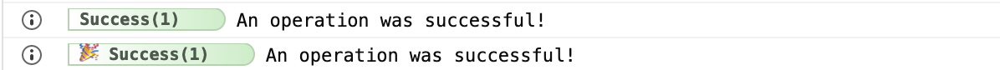

# Terminators

After you generated an Adze log instance from a [factory function](factories.md) and have applied the desired [modifiers](modifiers.md) you must terminate the method chain. The methods used to terminate the chain are called **terminators**.

When a log has been terminated it will generate a log render, check if it is allowed to print the log render, cache the log instance if a [Shed](/shed) exists, and then return a data object representing the log properties and the log render to any registered log listeners. After all of that it will return a [terminated log object](/guide/concepts.html#terminated-log-object).

Adze comes with 8 default log level terminators:

| Level | Name                    | Standard Method Used |
| ----- | ----------------------- | -------------------- |
| 0     | [attention](#attention) | info                 |
| 1     | [error](#error)         | error                |
| 2     | [warn](#warn)           | warn                 |
| 3     | [info](#info)           | info                 |
| 4     | [fail](#fail)           | info                 |
| 5     | [success](#success)     | info                 |
| 6     | [log](#log)             | log                  |
| 7     | [debug](#debug)         | debug                |
| 8     | [verbose](#verbose)     | debug                |

## attention

This level is useful for calling attention to important information and lives at the lowest level. You should use this sparingly since it's level is lower than error.

**Default log level** = 0

**Standard Log Method:** info

_This is not a standard API._

### Interface

```typescript
class BaseLog {
  public attention(...args: unknown[]): TerminatedLog<this>;
}
```

### Example

```javascript
import { adze } from 'adze';

adze().attention('Hello World!');
// With emoji's enabled
adze({ use_emoji: true }).attention('Hello World!');
```

### Output


## error

Use this for logging fatal errors or errors that impact functionality of your application.

**Default log level** = 1

**Standard Log Method:** error

**MDN Docs:** [https://developer.mozilla.org/en-US/docs/Web/API/Console/error](https://developer.mozilla.org/en-US/docs/Web/API/Console/error)

### Interface

```typescript
class BaseLog {
  public error(...args: unknown[]): TerminatedLog<this>;
}
```

### Example

```javascript
import { adze } from 'adze';

adze().error('An error occurred!');
// With emoji's enabled
adze({ use_emoji: true }).error('An error occurred!');
```

### Output


## warn

Use this for logging issues that may impact app performance in a less impactful way than an error.

**Default log level** = 2

**Standard Log Method:** warn

**MDN Docs:** [https://developer.mozilla.org/en-US/docs/Web/API/Console/warn](https://developer.mozilla.org/en-US/docs/Web/API/Console/warn)

### Interface

```typescript
class BaseLog {
  public warn(...args: unknown[]): TerminatedLog<this>;
}
```

### Example

```javascript
import { adze } from 'adze';

adze().warn("I'm warning you!");
// With emoji's enabled
adze({ use_emoji: true }).warn("I'm warning you!");
```

### Output


## info

Use this for logging general insights into your application. This level does not indicate any problems.

**Default log level** = 3

**Standard Log Method:** info

**MDN Docs:** [https://developer.mozilla.org/en-US/docs/Web/API/Console/info](https://developer.mozilla.org/en-US/docs/Web/API/Console/info)

### Interface

```typescript
class BaseLog {
  public info(...args: unknown[]): TerminatedLog<this>;
}
```

### Example

```javascript
import { adze } from 'adze';

adze().info('App information');
// With emoji's enabled
adze({ use_emoji: true }).info('App information');
```

### Output


## fail

Use this for logging network communication errors or other non-fatal errors that do not break your application.

**Default log level** = 4

**Standard Log Method:** info

_This is not a standard API._

### Interface

```typescript
class BaseLog {
  public fail(...args: unknown[]): TerminatedLog<this>;
}
```

### Example

```javascript
import { adze } from 'adze';

adze().fail('An operation failed to execute!');
// With emoji's enabled
adze({ use_emoji: true }).fail('An operation failed to execute!');
```

### Output


## success

Use this for logging successful network communications or other successful operations within your app.

**Default log level** = 5

**Standard Log Method:** info

_This is not a standard API._

### Interface

```typescript
class BaseLog {
  public success(...args: unknown[]): TerminatedLog<this>;
}
```

### Example

```javascript
import { adze } from 'adze';

adze().success('An operation was successful!');
// With emoji's enabled
adze({ use_emoji: true }).success('An operation was successful!');
```

### Output



## log

Use this for general logging that doesn't apply to any of the lower levels.

**Default log level** = 6

**Standard Log Method:** log

**MDN Docs:** [https://developer.mozilla.org/en-US/docs/Web/API/Console/log](https://developer.mozilla.org/en-US/docs/Web/API/Console/log)

### Interface

```typescript
class BaseLog {
  public log(...args: unknown[]): TerminatedLog<this>;
}
```

### Example

```javascript
import { adze } from 'adze';

adze().log('Logging a message.');
// With emoji's enabled
adze({ use_emoji: true }).log('Logging a message.');
```

### Output


## debug

Use this for logging information that you typically do not want to see unless you are debugging a problem with your application. This is typically hidden by default.

**Default log level** = 7

**Standard Log Method:** debug

**MDN Docs:** [https://developer.mozilla.org/en-US/docs/Web/API/Console/debug](https://developer.mozilla.org/en-US/docs/Web/API/Console/debug)

### Interface

```typescript
class BaseLog {
  public debug(...args: unknown[]): TerminatedLog<this>;
}
```

### Example

```javascript
import { adze } from 'adze';

adze().debug('Debugging an issue.');
// With emoji's enabled
adze({ use_emoji: true }).debug('Debugging an issue.');
```

### Output


## verbose

Use this for logging extremely detailed debugging information. Use this level when the values you are logging are granular enough that they are no longer easily human readable.

**Default log level** = 8

**Standard Log Method:** verbose

_This is not a standard API._

### Interface

```typescript
class BaseLog {
  public verbose(...args: unknown[]): TerminatedLog<this>;
}
```

### Example

```javascript
import { adze } from 'adze';

adze().verbose('Logging some extreme detail.');
// With emoji's enabled
adze({ use_emoji: true }).verbose('Logging some extreme detail.');
```

### Output


