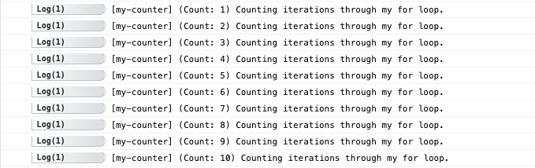

# Using Adze

Now that we understand the concepts of Adze from a high level, let's dive a little deeper into how to use Adze logs.

## Factories

As you know from the high-level concepts, Adze logs are typically generated from a factory function. Out-of-the-box you get the `adze()` function that is your normal entry point into creating logs. However, you can also use `seal()` and `bundle()` to take advantage of some other cool features that we will review below.

### adze

The `adze()` factory take a single parameter which is a [Configuration](#add-me-later) object that controls how this log instance will behave. The factory function will then return a new Adze log instance that you can chain modifiers with and ultimately terminate.

Here are a few examples of some patterns that you can use:

```typescript
import { adze } from 'adze';

// Here we are creating a log with a configuration that will only apply to this instance
adze({ use_emoji: true }).log('Hello World with emoji!');

// But... what if we want to apply the same configuration to multiple logs?
const cfg = {
  use_emoji: true,
};

adze(cfg).log('A log with emoji enabled.');
adze(cfg).log('Another log with emoji enabled');
```

Optionally, you could import and export your configuration across your app:

```typescript
import { adze } from 'adze';
import { cfg } from '~/configuration.ts';

// Generating a log with a shared configuration
adze(cfg).log('Hello World with emoji!');
```

### seal

We've seen some patterns for reusing configuration for your logs, but what if we would like to create a log factory that has the configuration and even some modifiers baked in? This is the case where you would use `seal()`.

Here is an example of sealing a log configuration into a new factory:

```typescript
import { adze } from 'adze';

// Let's seal a configuration and namespace into a new log factory
const log = adze({ use_emoji: true }).ns('my-project').seal();

/* Now we can create new logs from our factory that enable emoji's and all
 * have the 'my-project' namespace! */
log().info('This log is generated from a new factory');
log().success('This is another log from the same factory');
```

**Output**


### bundle

There are occassions where you may want to group logs together in a collection that you can later recall and filter. Adze provides a `bundle()` function that will wrap an Adze factory function and curry each subsequent log that is generated from the bundle.

```typescript
import { adze, bundle, filterLabel } from 'adze';

const bundled = bundle(adze());

bundled().label('foo').info('This log is bundled.');
const { log } = bundled().label('bar').log('This log is also bundled.');

filterLabel(log.bundle, 'foo');
```

## Modifiers

Once you have an Adze log instance you can now start applying modifiers. Modifiers are methods that alter the log in some way and then return
the log instance so that you may chain more modifiers or terminate the instance. Keep in mind, some modifiers have a dependency on the presence of a [`label()`](#label) and labels rely on Shed.

### count

The count modifier tells the log to increment a counter associated to the log's [`label()`](#label).

#### Example

```typescript
import { adze, createShed } from 'adze';

// A shed is required for labels and modifiers that depend on them
createShed();

for (let i = 0; i < 10; i += 1) {
  adze()
    .label('my-counter')
    .count.log('Counting iterations through my for loop.');
}
```

#### Output


