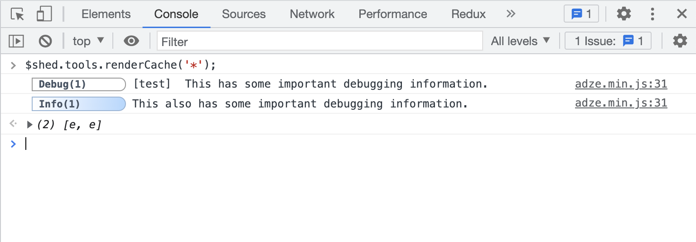

# Using Shed

:::danger
This version is now deprecated! Please upgrade to [version 2](https://adzejs.com/)!
:::

Let's take a deeper dive into each of Shed's public methods.

## addLabel

Adds a [label](modifiers.md#label) instance to the Shed.

### Interface

```typescript
class Shed {
  public addLabel(label: Label): void;
}
```

### Example

```javascript
import { adze, createShed, Label } from 'adze';

// Create a Shed instance
const shed = createShed();

// Let's create a Label instance
const label = new Label('foo');

// Now we can add the label named 'foo' to the Shed
shed.addLabel(label);
```

## addListener

Adds a log listener to Shed that invokes the provided callback function if a log passes the provided [level filter](data.md#level-filter).

### Interface

```typescript
class Shed {
  public addListener(
    levels: LevelFilter,
    cb: ListenerCallback
  ): ListenerLocations;
}
```

### Example

```javascript
import { adze, createShed } from 'adze';

const shed = createShed();

// We'll listen to all levels
shed.addListener('*', (data, render) => {
  // Do stuff with the log data.
  if (render) {
    // Do something with the log if it was rendered
  }
});
```

## cacheLimit

Getter and setter for manually overriding the configured or default log cache limit.

### Interface

```typescript
class Shed {
  public set cacheLimit(limit: number);
  public get cacheLimit(): number;
}
```

### Example

```javascript
import { adze, createShed } from 'adze';

const shed = createShed({
  cacheLimit: 300,
});

// Override the cache limit
shed.cacheLimit = 500;

// Let's get the cache limit
const cacheLimit = shed.cacheLimit;
// cacheLimit => 500
```

## cacheSize

Getter that returns the number of logs currently cached.

### Interface

```typescript
class Shed {
  public get cacheSize(): number;
}
```

### Example

```javascript
import { adze, createShed } from 'adze';

const shed = createShed();

adze().log('First log');
adze().log('Second log');
adze().log('Third log');

// Let's get the cache size
const size = shed.cacheSize;
// size => 3
```

## config

Sets the value of the Shed configuration.

### Interface

```typescript
class Shed {
  public set config(cfg: ShedUserConfig | undefined);
}
```

### Example

```javascript
import { adze, createShed } from 'adze';

// Creating a Shed instance with no config overrides
const shed = createShed({
  globalCfg: {
    logLevel: 0,
  },
});

// Now we'll override the configuration
shed.config = {
  globalCfg: {
    logLevel: 3,
  },
};
```

## fireListeners

Fires any listeners that are watching the log level defined with the provided [final log data](data.md#log-data). The final log data and render object will be passed to the listener callback.

_NOTE:_ It is not necessary to call this method manually to fire listeners. When a log is terminated it will fire it automatically. However, if you are recalling a log and want to fire the listener for it again, you'll need to use the pattern in the example below.

### Interface

```typescript
// Versions < 1.3.0
class Shed {
  public fireListeners(log: FinalLogData, render: LogRender | null): void;
}

// Versions >= 1.3.0
class Shed {
  public fireListeners(log: FinalLogData, render: LogRender | null, printed: boolean): void;
}
```

### Example

For information about the type guard in this example, refer to [isFinalLogData](filtering-and-utility-functions.md#isfinallogdata).

```javascript
import { adze, createShed, isFinalLogData } from 'adze';

const shed = createShed();

// Let's create a listener and store it's location in a variable
shed.addListener('*', (data, render) => {
  // Do stuff with the log data.
});

const { log, render, printed } = adze().info('some important info.');
const data = log.data;

// Listeners only accept finalized log data so we must use a type guard to verify it
if (isFinalLogData(data)) {
  shed.fireListeners(data, render, printed);
}
```

## getCollection

Recalls all of the cached logs based on the provided [level filter](data.md#level-filter) as a bundle. This is useful for applying [filters](filtering-and-utility-functions.md) to them, [re-rendering](filtering-and-utility-functions.md#rerender) them, etc.

### Interface

```typescript
class Shed {
  public getCollection(levels: LevelFilter): Collection;
}
```

### Example

```javascript
import { adze, createShed, rerender } from 'adze';

const shed = createShed();

adze().log('First log');
adze().log('Second log');
adze().log('Third log');

// Let's get the a collection of all cached logs
const collection = shed.getCollection('*');

// Now we can re-render them all
collection.forEach(rerender);
```

## getLabel

Get a [label](modifiers.md#label) instance from the Shed by name.

### Interface

```typescript
class Shed {
  public getLabel(name: string): Label | undefined;
}
```

### Example

```javascript
import { adze, createShed } from 'adze';

// Create a Shed instance
const shed = createShed();

// Create a log with a label
adze().label('foo').log('Hello World!');

// Now we can get the label instance named 'foo'
const label = shed.getLabel('foo');
```

## hasLabel

Returns a boolean value indicating the existence of a label in the Shed.

### Interface

```typescript
class Shed {
  public hasLabel(name: string): boolean;
}
```

### Example

```javascript
import { adze, createShed, Label } from 'adze';

// Create a Shed instance
const shed = createShed();

// Create a log with a label
adze().label('foo').log('Hello World!');

// Now we can add the label named 'foo' to the Shed
const labelExists = shed.hasLabel('foo');
// labelExists => true
```

## hasOverrides

Indicates whether this Shed instance has global Adze configuration overrides set.

### Interface

```typescript
class Shed {
  public get hasOverrides(): boolean;
}
```

### Example

```javascript
import { adze, createShed } from 'adze';

// Creating a Shed instance with no config overrides
const shed = createShed();

// Let's check if the Shed has global overrides configured
const has_overrides = shed.hasOverrides;
// has_overrides => false
```

## overrides

Returns the current value of the global [Adze configuration](/config/#adze-configuration) overrides.

### Interface

```typescript
class Shed {
  public get overrides(): Configuration | null;
}
```

### Example

```javascript
import { adze, createShed } from 'adze';

// Creating a Shed instance with no config overrides
const shed = createShed({
  globalCfg: {
    logLevel: 0,
  },
});

// Let's get our global configuration overrides
const overrides = shed.overrides;
```

## removeListener

Adds a log listener to Shed that invokes the provided callback function if a log passes the provided [level filter](data.md#level-filter).

### Interface

```typescript
class Shed {
  public removeListener(locations: ListenerLocations): void;
}
```

### Example

```javascript
import { adze, createShed } from 'adze';

const shed = createShed();

// Let's create a listener and store it's location in a variable
const loc = shed.addListener('*', (data, render) => {
  // Do stuff with the log data.
});

// We can now tear down the listener at a later time
shed.removeListener(loc);
```

## store

Stores a log in the Shed.

_NOTE:_ This is not required to be done manually. If a Shed exists logs will automatically be stored in it until the cache limit has been reached.

### Interface

```typescript
class Shed {
  public store(log: BaseLog): void;
}
```

### Example

```javascript
import { adze, createShed } from 'adze';

const shed = createShed();

// Generate a log and get the instance
const { log } = adze().info('Some important info.');

// Store the log
shed.store(log);
```

## $shed.tools

Manual debugging tools primarily for use in the web browser. To use the tools, access them via `window.$shed.tools` or simply `$shed.tools` in your browser console. Any of the methods listed in the interface below will be made available to you. For all methods other than `renderCache`, `renderNamespace`, and `renderLabel` please refer to the documentation for [Filtering & Utility Functions](filtering-and-utility-functions.md).

> Supported in versions >= 1.4.0

### Interface

```typescript
class Shed {
  public tools: Tools;
}

class Tools {

  /**
   * Pass-through alias for the render function.
   */
  public render = render;

  /**
   * Pass-through alias for the rerender function.
   */
  public rerender = rerender;

  /**
   * Pass-through alias for the filterCollection function.
   */
  public filterCollection = filterCollection;

  /**
   * Pass-through alias for the filterLabel function.
   */
  public filterLabel = filterLabel;

  /**
   * Pass-through alias for the filterLevel function.
   */
  public filterLevel = filterLevel;

  /**
   * Pass-through alias for the filterNamespace function.
   */
  public filterNamespace = filterNamespace;

  /**
   * Shortcut method for rendering a level-filtered collection from the Shed cache.
   */
  public renderCache(filter: LevelFilter): Collection;

  /**
   * Shortcut method for rendering a level and namespace filtered collection from the Shed cache.
   */
  public renderNamespace(filter: LevelFilter, ...ns: string[]): Collection;

  /**
   * Shortcut method for rendering a level and label filtered collection from the Shed cache.
   */
  public renderLabel(filter: LevelFilter, label: string): Collection;
}
```

### Example


