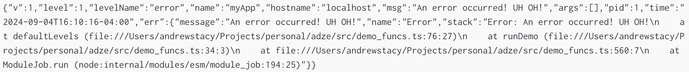

# Formatters

The primary purpose of Adze is to give the user simple ways of shaping their logs to fit their
needs. Adze comes with **four** formatters out of the box.

| Formatter                   | Value        | Description                                                                                                                                                                |
| --------------------------- | ------------ | -------------------------------------------------------------------------------------------------------------------------------------------------------------------------- |
| [Pretty](#pretty-formatter) | `"pretty"`   | The default formatter. This prints logs in a pretty, human-readable format.                                                                                                |
| [JSON]()                    | `"json"`     | This formatter prints logs as machine-readable JSON objects that are compatible with the [Bunyan CLI](https://github.com/trentm/node-bunyan?tab=readme-ov-file#cli-usage). |
| [Standard]()                | `"standard"` | This formatter prints human-readable logs for a simple **stdout** format for terminals or files.                                                                           |
| [Common]()                  | `"common"`   | This formatter prints logs according to the [Common Log Format](https://en.wikipedia.org/wiki/Common_Log_Format).                                                          |

## Pretty Formatter

The **Pretty** formatter is the default formatter used by Adze. It formats logs in a pretty,
human-readable manner.

To use it, set the [User Configuration](./configuration.md#user-configuration) `format` value to be
`"pretty"`.

```typescript
import adze, { setup } from 'adze';

setup({
  format: 'pretty',
});
```

#### Browser and Terminal Output


<br />

## JSON Formatter

The JSON formatter is used to generate machine-readable JSON logs. The logs that are generated are
compatible with the [Bunyan CLI](https://github.com/trentm/node-bunyan?tab=readme-ov-file#cli-usage)
for parsing logs to be human-readable or for filtering them based on their values.

To use it, set the [User Configuration](./configuration.md#user-configuration) `format` value to be
`"json"`.

```typescript
import adze, { setup } from 'adze';

setup({
  format: 'json',
});
```

### JsonLogFormatMeta Interface

JSON formatted logs require some meta data to be compatible with the [Bunyan JSON Schema](https://github.com/trentm/node-bunyan?tab=readme-ov-file#log-record-fields).
To apply these values you must include them when calling the [meta modifier](./modifiers.md#meta) or
apply them in the [setup function](./configuration.md#setup-function).

#### Usage Example

To get TS type checking for these values, Adze exports an interface called `JsonLogFormatMeta` that
can be passed to the meta modifier as a generic type.

The minimum required fields are `name` and `hostname`.

```typescript
import adze, { setup, type JsonLogFormatMeta } from 'adze';

setup({
  level: 'debug',
  format: 'json',
});

const logger = adze.meta<JsonLogFormatMeta>({ name: 'myApp', hostname: 'localhost' }).seal();
export default logger;

// --- OR ALTERNATIVELY

setup<JsonLogFormatMeta>({
  level: 'debug',
  format: 'json',
  meta: {
    name: 'myApp',
    hostname: 'localhost',
  },
});
```

If you want to later apply extra optional JSON log meta fields, you can use the
`JsonLogOptionalFields` interface.

```typescript
// ./elsewhere.ts
import { type JsonLogOptionalFields } from 'adze';
import logger from './logger';

logger.meta<JsonLogOptionalFields>({ latency: 400 }).debug('Logging the latency of our app.');
```

#### Interface

```typescript
interface JsonLogFormatMeta {
  /**
   * The name of the application or logger that is generating the log.
   */
  name: string;
  /**
   * The hostname of the machine that generated the log.
   */
  hostname: string;
  /**
   * The name of the log level.
   */
  levelName?: string;
  /**
   * Optional. Object giving log call source info. This is added automatically by Bunyan if the
   * "src: true" config option is given to the Logger. Never use in production as this is really
   * slow.
   */
  src?: string;
  /**
   * A caught JS exception. This will be added anytime adze detects an Error object in the log
   * terminator arguments. You may also manually serialize an error with the `serializeError`
   * function from adze.
   */
  err?: JsonLogError;
  /**
   * A request identifier. Including this field in all logging tied to handling a particular request
   * to your server is strongly suggested. This allows post analysis of logs to easily collate all
   * related logging for a request. This really shines when you have a SOA with multiple services
   * and you carry a single request ID from the top API down through all APIs.
   */
  req_id?: string;
  /**
   * An HTTP server request. This can be generated with the `serializeRequest` function from adze.
   */
  req?: JsonLogHttpRequest;
  /**
   * An HTTP server response. This can be generated with the `serializeResponse` function from adze.
   */
  res?: JsonLogHttpResponse;
  /**
   * The latency of the logged request in milliseconds.
   */
  latency?: number;
  /**
   * Any additional meta data that you want to include in the log.
   */
  meta?: Record<string, unknown>;
}

/**
 * Type for a JSON Log error on the `err` property.
 */
export interface JsonLogError {
  message: string;
  name: string;
  stack?: string;
}

/**
 * Type for declaring a JSON log HTTP request object.
 *
 * This can be generated from the `serializeRequest` function from adze.
 */
export interface JsonLogHttpRequest {
  method: HttpMethod;
  url: string;
  headers: Record<string, string>;
  body?: string;
  remoteAddress: string;
  remotePort?: number;
  username?: string;
}

/**
 * Type for declaring a JSON log HTTP response object.
 *
 * This can be generated from the `serializeResponse` function from adze.
 */
export interface JsonLogHttpResponse {
  statusCode: HttpStatus;
  header: string;
}
```

### JsonLogFormatMeta Serializer Functions

For the JSON log meta properties of `err`, `req`, and `res` Adze provides a set of serializer
functions to make it much simpler to apply these meta data values.

#### serializeError

---

This function accepts a [JavaScript Error object](https://developer.mozilla.org/en-US/docs/Web/JavaScript/Reference/Global_Objects/Error)
and returns a serialized meta data object that is compatible with the
[JsonLogFormatMeta interface](#jsonlogformatmeta-interface).

##### Example

```typescript
import adze, { serializeError, type JsonLogOptionalFields } from 'adze';

// Doing some stuff and an error occurs!
const errMsg = 'An error occurred! UH OH!';
adze
  .meta<JsonLogOptionalFields>({
    err: serializeError(new Error(errMsg)),
  })
  .error(errMsg);
```

##### Example Output



<br />

#### serializeRequest

---

This function accepts a [JavaScript Request object](https://developer.mozilla.org/en-US/docs/Web/API/Request)
and returns a serialized meta data object that is compatible with the
[JsonLogFormatMeta interface](#jsonlogformatmeta-interface).

##### Example

```typescript
import adze, { serializeRequest, type JsonLogOptionalFields } from 'adze';

const request = new Request('https://example.com/login', {
  method: 'POST',
  headers: {
    'x-hi': 'Mom',
    connection: 'close',
    Authorization: 'Basic ' + btoa('username:password'),
  },
  body: JSON.stringify({ foo: 'bar' }),
});

// The Request serializer returns a promise so it must be awaited.
adze
  .meta<JsonLogOptionalFields>({
    req: await serializeRequest(request),
  })
  .log('Made a request!');
```

##### Example Output


<br />

#### serializeResponse

---

This function accepts a [JavaScript Response object](https://developer.mozilla.org/en-US/docs/Web/API/Response)
and returns a serialized meta data object that is compatible with the
[JsonLogFormatMeta interface](#jsonlogformatmeta-interface).

##### Example

```typescript
import adze, { serializeResponse, type JsonLogOptionalFields } from 'adze';

// We'll make a fake response just for this example
const response = new Response('hello world!', {
  status: 200,
  statusText: 'OK',
  headers: { boop: 'beep' },
});
Object.defineProperty(response, 'url', { value: 'https://example.com/login' });

// The Request serializer returns a promise so it must be awaited.
adze
  .meta<JsonLogOptionalFields>({
    res: await serializeResponse(response),
  })
  .log('Received a response!');
```

##### Example Output


