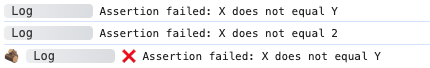
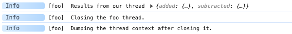
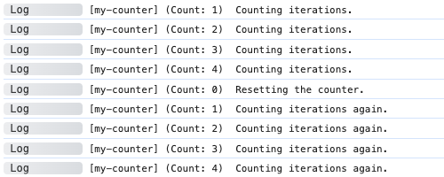
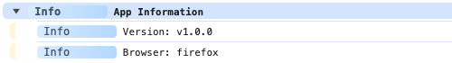
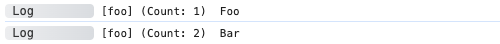
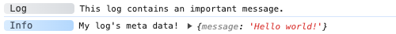
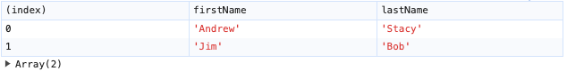
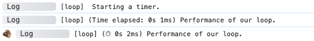
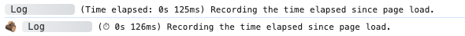
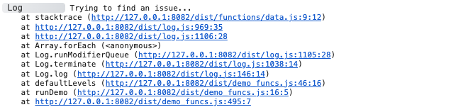

# Modifiers

Once you have an Adze log instance you can now start applying modifiers. Modifiers are methods that alter the log in some way and then return
the log instance so that you may chain more modifiers or terminate the instance. Keep in mind, some modifiers have a dependency on the presence of a [label](#label) and labels rely on GlobalStore.

## assert

This modifier accepts an assertion boolean expression and will only print if the boolean expression fails (is a falsy value).

[**MDN Docs**](https://developer.mozilla.org/en-US/docs/Web/API/Console/assert)

#### Interface

```typescript
class Log {
  public assert(expression: boolean): Log;
}
```

#### Example

```typescript
import adze from 'adze';

const x = 2;
const y = 3;

// Let's assert that x and y should be equal
adze.assert(x === y).log('X does not equal Y');

// This log will not print because the assertion passes
adze.assert(x === 2).log('X does not equal 2');

// Let's look at the output with emoji's enabled
adze.withEmoji.assert(x === y).log('X does not equal Y');
```

#### Browser Output



#### Standard Output


## closeThread

This modifier closes a thread by deleting its tracked context from a shared label group.

This is used primarily in conjunction with a [label](#label) and the [thread]() terminator for
implementing [Threading](../getting-started/threading.md).

_This is not a standard API._

#### Interface

```typescript
class Log {
  public get closeThread(): Log;
}
```

#### Example

```typescript
import adze, { setup } from 'adze';

function add(a: number, b: number) {
  const answer = a + b;
  adze.label('foo').thread('added', { a, b, answer });
  return answer;
}

function subtract(x: number, y: number) {
  const answer = x - y;
  adze.label('foo').thread('subtracted', { x, y, answer });
  return answer;
}

add(1, 2);
subtract(4, 3);

adze.label('foo').dump.info('Results from our thread');
adze.label('foo').closeThread.info('Closing the foo thread.');
adze.label('foo').dump.info('Dumping the thread context after closing it.');
```

#### Browser Output



#### Standard Output


## count

The count modifier tells the log to increment a counter associated to the log's [label](#label).

[**MDN Docs**](https://developer.mozilla.org/en-US/docs/Web/API/Console/count)

#### Interface

```typescript
class Log {
  public get count(): Log;
}
```

#### Example

```typescript
import adze from 'adze';

for (let i = 0; i < 5; i += 1) {
  adze.label('my-counter').count.log('Counting iterations.');
}
```

#### Browser Output


#### Standard Output


## countClear

The countClear modifier completely clears the count from a [label](#label). Rather than setting the count to 0 it instead becomes null.

_NOTE:_
This method is deliberately a modifier rather than a terminator because it forces you to write a log that gives you insight into when a counter was cleared. It also makes the countClear log recallable from the [GlobalStore](/guide/globalstore) in the order it was created.

_This is not a standard API._

#### Interface

```typescript
class Log {
  public get countClear(): Log;
}
```

#### Example

```typescript
import adze from 'adze';

for (let i = 0; i < 4; i += 1) {
  adze.label('my-counter').count.log('Counting iterations.');
}

adze.label('my-counter').countClear.log('Clearing the counter.');

adze.label('my-counter').log('A log with the my-counter label but no count.');
```

#### Output


## countReset

The countReset modifier resets the counter associated to the log's [label](#label) to `0`.

_NOTE:_
This method is deliberately a modifier rather than a terminator because it forces you to write a log
that gives you insight into when a counter was reset. It also makes the countReset log recallable
from the [global store](/guide/globalstore) in the order it was created.

[**MDN Docs**](https://developer.mozilla.org/en-US/docs/Web/API/Console/countReset)

#### Interface

```typescript
class Log {
  public get countReset(): Log;
}
```

#### Example

```typescript
import adze from 'adze';

for (let i = 0; i < 4; i += 1) {
  adze.label('my-counter').count.log('Counting iterations.');
}

adze.label('my-counter').countReset.log('Resetting the counter.');

for (let i = 0; i < 4; i += 1) {
  adze.label('my-counter').count.log('Counting iterations again.');
}
```

#### Browser Output



#### Standard Output


## dir

The dir modifier transforms the output of the log by directing it to use the `console.dir()` method for printing purposes only.

_NOTE:_ Logs that use `dir` as a modifier should only be given a single argument which is usually an object. If multiple arguments are given, behavior may differ between browser and node environments. Refer to the MDN docs for more details.

[**MDN Docs**](https://developer.mozilla.org/en-US/docs/Web/API/Console/dir)

#### Interface

```typescript
class Log {
  public get dir(): Log;
}
```

#### Example

```typescript
import adze from 'adze';

adze.dir.log({ foo: 'bar' });
```

#### Browser Output


#### Standard Output


## dirxml

The dirxml modifier transforms the output of the log by directing it to use the `console.dirxml()`
method for printing purposes only. This is mainly useful for logging out DOM elements.

_NOTE:_ Logs that use `dirxml` as a modifier should only be given a single argument which is usually
a DOM Element or other XML object. If multiple arguments are given, behavior may differ between
browser and node environments. Refer to the MDN docs for more details.

[**MDN Docs**](https://developer.mozilla.org/en-US/docs/Web/API/Console/dirxml)

#### dirxml Interface

```typescript
class Log {
  public get dirxml(): Log;
}
```

#### Example

```typescript
import adze from 'adze';

// create a new div element
const newDiv = document.createElement('div');
newDiv.setAttribute('id', 'test');
// and give it some content
const newContent = document.createTextNode('Hi there and greetings!');
// add the text node to the newly created div
newDiv.appendChild(newContent);

adze.dirxml.log(newDiv);
```

## dump

This modifier instructs the [labeled](#label) log to print the context values from a [thread](#thread).

Refer to the [Mapped Diagnostic Context (MDC)](mapped-diagnostic-context.md) page for more information about the purpose of MDC.

This modifier is dependent upon having a [label](#label).

_This is not a standard API._

#### Interface

```typescript
class Log {
  public get dump(): Log;
}
```

#### Example

```typescript
import adze, { setup } from 'adze';

const store = setup();

// Creating a GlobalStore listener is a great way to get meta data from your
// threaded logs to write to disk or pass to another plugin, library,
// or service.
store.addListener('*', (log) => {
  // Do something with `log.data?.label?.context.added` or `log.data?.label?.context.subtracted`.
});

function add(a: number, b: number) {
  const answer = a + b;
  adze.label('foo').thread('added', { a, b, answer });
  return answer;
}

function subtract(x: number, y: number) {
  const answer = x - y;
  adze.label('foo').thread('subtracted', { x, y, answer });
  return answer;
}

add(1, 2);
subtract(4, 3);

adze.label('foo').dump.info('Results from our thread');
```

#### Browser Output


#### Standard Output


## format

The format modifier sets the formatter that will be used for the log. This can also be used in
conjunction with the [seal terminator]() to create specifically formatted child loggers.

_This is not a standard API._

#### Interface

```typescript
class Log {
  public format(format: string): Log;
}
```

#### Example

```typescript
import adze from 'adze';

adze.format('standard').log('Logging a JSON formatted message.');
```

#### Browser Output


#### Standard Output


## group

The group modifier starts an uncollapsed group of logs. This means that all subsequent logs will be nested beneath this log until a [groupEnd](#groupEnd) log occurs.

[**MDN Docs**](https://developer.mozilla.org/en-US/docs/Web/API/Console/group)

#### Interface

```typescript
class Log {
  public get group(): Log;
}
```

#### Example

```typescript
import adze from 'adze';

// Some info about our app.
const version = 'v1.0.0';
const browser = 'firefox';

adze.group.info('App Information');
adze.info(`Version: ${version}`);
adze.info(`Browser: ${browser}`);
adze.groupEnd.info();
```

#### Browser Output


#### Standard Output


## groupCollapsed

The groupCollapsed modifier starts an collapsed group of logs. This means that all subsequent logs will be nested beneath this log until a [groupEnd](#groupEnd) log occurs.

_Note:_ This will not be collapsed in a terminal environment since there is no way to uncollapse it.

[**MDN Docs**](https://developer.mozilla.org/en-US/docs/Web/API/console/groupCollapsed_static)

#### Interface

```typescript
class Log {
  public get groupCollapsed(): Log;
}
```

#### Example

```typescript
import adze from 'adze';

// Some info about our app.
const version = 'v1.0.0';
const browser = 'firefox';

adze.groupCollapsed.info('App Information');
adze.info(`Version: ${version}`);
adze.info(`Browser: ${browser}`);
adze.groupEnd.info();
```

#### Browser Output



#### Standard Output


## groupEnd

The groupEnd modifier ends a log group. Any logs following a groupEnd will no longer be grouped.

[**MDN Docs**](https://developer.mozilla.org/en-US/docs/Web/API/Console/groupEnd)

#### Interface

```typescript
class Log {
  public get groupEnd(): Log;
}
```

#### Example

```typescript
import adze from 'adze';

// Some info about our app.
const version = 'v1.0.0';
const browser = 'firefox';

adze.group.info('App Information');
adze.info(`Version: ${version}`);
adze.info(`Browser: ${browser}`);
adze.groupEnd.info(); // <-- Ends the group

adze.info('Some other information...');
```

#### Browser Output


#### Node Output


## if

This modifier accepts a boolean expression and will only print if the boolean expression passes (is
a truthy value). This modifier is the opposite behavior of the [assert](#assert) modifier.

_This is not a standard API._

#### Interface

```typescript
class Log {
  public if(expression: boolean): Log;
}
```

#### Example

```typescript
import adze from 'adze';

const x = 2;
const y = 3;

// Print the log if x equals 2
adze.if(x === 2).log('X equals 2');

// This log will not print because the if fails
adze.if(x === y).log('X does not equal Y');

// Let's look at the output with emoji's enabled
adze.withEmoji.if(y === 3).log('Y equals 3');
```

#### Browser Output


#### Node Output


## label

Applies an identifying label to a log. All logs that share the same label will be linked together in
the [Global Store](). This enables global tracking for modifiers that require a label as a
prerequisite.

These are the modifiers that require a label to be useful:

- [count](#count)
- [countReset](#countreset)
- [countClear](#countclear)
- [closeThread](#closeThread)
- [thread](#thread)
- [time](#time)
- [timeNow](#timenow)
- [timeEnd](#timeend)

_This is not a standard API._

#### Interface

```typescript
class Log {
  public label(name: string): Log;
}
```

#### Example

```typescript
import adze from 'adze';

// Labels can be applied in any order in a modifier chain
adze.label('foo').count.log('Foo');
adze.count.label('foo').log('Bar');
```

#### Browser Output



#### Node Output


## meta

The meta modifier allows you to attach meta data to your log instance. You can then retrieve it at a
later time from within a log listener or by calling the `data()` method on a log instance.

_This is not a standard API._

#### Interface

```typescript
class Log {
  // Types are Overloaded
  public meta<T>(key: string, val: T): Log;
  public meta<KV extends [string, any]>(...[key, val]: KV): Log;
}
```

#### Basic Example

```typescript
import adze, { setup } from 'adze';

// Let's create a super important message to attach as meta data
const info = 'Hello World!';

adze.meta({ message: 'Hello world!' }).log('This log contains an important message.');
```

#### Example with Generic Type (TS Only)

```typescript
import adze, { setup, type JsonLogFormatMeta } from 'adze';

// We'll setup our logger to output JSON.
setup({
  format: 'json',
});

adze
  // The type here ⬇️ ensures that you input the values required by the JSON formatter.
  .meta<JsonLogFormatMeta>({ hostname: 'localhost', name: 'myapp' })
  .log('This log contains an important message.');
```

#### Example with Listener

```typescript
import adze, { setup } from 'adze';

// Let's optionally create a GlobalStore to show the use of meta data on listeners
const store = setup();

// We'll listen only to logs of level 6 which is "log"
store.addListener('log', (log) => {
  adze.info("My log's meta data!", log.data?.meta);
});

adze.meta({ message: 'Hello world!' }).log('This log contains an important message.');
```

#### Browser Output from Listener



#### Node Output from Listener


## namespace / ns

This modifier adds one or more namespaces to a log. These are mainly used as
human readable group identifiers but are also useful for filtering logs and for identifying logs
from a log listener. This modifier does not do any special grouping under the hood.

Multiple calls to the namespace modifier are additive by nature and will not overwrite previously
applied namespaces. This is especially useful when working with [sealed]() child loggers.

The `ns()` method is just a shorter alias for `namespace()`.

_This is not a standard API._

#### Interface

```typescript
class Log {
  public namespace(...ns: string[]): Log;
  public ns(...ns: string[]): Log;
}
```

#### Example

```typescript
import adze from 'adze';

adze.namespace('tix-123').log('Important info for a feature.');
adze
  .namespace('tix-123', 'tix-456', 'tix-789')
  .log('Multiple namespace entry simplified by the restof operator.');

// ns() is a shorthand alias for namespace()
adze.ns('tix-456').log('More info');

// Multiple calls to namespace/ns are additive
adze.ns('foo').ns('bar', 'baz').log('This log has all applied namespaces.');
```

#### Browser Output


#### Node Output


### Namespaces with Constraints

Adze also supports passing a constraints type when [sealing]() a new logger or when calling the
[setup]() function. This is beneficial because it will force users to add any new namespace
to the central constraints type. This will make it easier to filter namespaces throughout your
application because you will only have a single place to reference to understand what namespaces are
being used.

```typescript
import adze, { setup } from 'adze';

// First we will create our app namespace constraints.
type AllowedNamespaces = 'foo' | 'bar' | 'hello' | 'world';

// We can apply it when we call the `setup` function, or...
setup<AllowedNamespaces>();

// Alternatively, we can apply the namespace constraint type when sealing a child logger.
const logger = adze.seal<AllowedNamespaces>();

// Now when we define namespaces for a log a type error will be thrown if the
// namespace provided isn't in the allowedNamespaces union type.
logger.ns('foo', 'bar', 'baz').fail('This is not allowed.');
//                      ~~~~~
// Argument of type '"baz"' is not assignable to parameter of type '"foo" | "bar" | "hello" | "world"'.
```

## silent

The silent modifier allows a log to be terminated and cached but prevents it from printing to the
console. Because the log is still processed, it will still trigger [middleware hooks]() and
[listeners]().

_This is not a standard API._

#### Interface

```typescript
class Log {
  public get silent(): Log;
}
```

#### Example

```typescript
import adze from 'adze';

adze.log('Knock knock!');
adze.silent.log('Crickets...');
adze.log('I guess nobody is home :(');
```

#### Browser Output


#### Node Output


## table

The table modifier transforms the output of the log by directing it to use the `console.table()`
method for printing purposes only.

[**MDN Docs**](https://developer.mozilla.org/en-US/docs/Web/API/Console/table)

#### Interface

```typescript
class Log {
  public get table(): Log;
}
```

#### Example

```typescript
import adze from 'adze';

const tabular_data = [
  { firstName: 'Andrew', lastName: 'Stacy' },
  { firstName: 'Jim', lastName: 'Bob' },
];

adze.table.log(tabular_data);
```

#### Browser Output



#### Node Output


## time

This modifier starts a timer associated to the log's [label](#label). This is useful for taking
performance measurements. A log with a time modifier must be followed by a log with a
[timeEnd](#timeend) modifier in order to get the final measurement.

This modifier is dependent upon having a [label](#label).

[**MDN Docs**](https://developer.mozilla.org/en-US/docs/Web/API/Console/time)

#### Interface

```typescript
class Log {
  public get time(): Log;
}
```

#### Example

```typescript
import adze from 'adze';

// Let's create a timer for performance
adze.label('loop').time.log('Starting a timer.');

for (let i = 0; i < 10000; i += 1) {
  // Do a lot of stuff that takes time
}

// End the timer to get the loop performance
adze.label('loop').timeEnd.log('Performance of our loop.');

// Let's see the output with emoji's
adze.withEmoji.label('loop').timeEnd.log('Performance of our loop.');
```

#### Browser Output


#### Node Output


## timeEnd

This modifier ends a timer associated to the log's [label](#label). This is useful for taking
performance measurements. A log with a timeEnd modifier must be preceded by a log with a
[time](#time) modifier in order to get the final measurement.

This modifier is dependent upon having a [label](#label).

[**MDN Docs**](https://developer.mozilla.org/en-US/docs/Web/API/Console/timeEnd)

#### Interface

```typescript
class Log {
  public get time(): Log;
}
```

#### Example

```typescript
import adze from 'adze';

// Let's create a timer for performance
adze.label('loop').time.log('Starting a timer.');

for (let i = 0; i < 10000; i += 1) {
  // Do a lot of stuff that takes time
}

// End the timer to get the loop performance
adze.label('loop').timeEnd.log('Performance of our loop.');

// Let's see the output with emoji's
adze.withEmoji.label('loop').timeEnd.log('Performance of our loop.');
```

#### Browser Output



#### Node Output


## timeNow

This modifier logs the time elapsed since the page has loaded. This is useful for measuring page
load performance rather than performance of a particular piece of code.

This modifier is **not** dependent upon a [label](#label).

_This is not a standard API._

#### Interface

```typescript
class Log {
  public get timeNow(): Log;
}
```

#### Example

```typescript
import adze from 'adze';

for (let i = 0; i < 10000; i += 1) {
  // Do a lot of stuff that takes time
}

// Let's create a timer for performance
adze.timeNow.log('Recording the time elapsed since page load.');

// Let's see what it looks like with emoji's enabled.
adze.withEmoji.timeNow.log('Recording the time elapsed since page load.');
```

#### Browser Output



#### Node Output


## timestamp

This modifier instructs the log to render an [ISO 8601](https://en.wikipedia.org/wiki/ISO_8601)
timestamp.

_This is not a standard API._

#### Interface

```typescript
class Log {
  public get timestamp(): Log;
}
```

#### Example

```typescript
import adze from 'adze';

adze.timestamp.log('This log has a timestamp.');
```

#### Browser Output


#### Node Output


## trace

This modifier instructs the log to print a stacktrace using the standard `console.trace()` method.

_NOTE:_ The styling for logs using this modifier varies by browser. Chrome will render the log
message with proper styling while Firefox will only render the message unstyled.

[**MDN Docs**](https://developer.mozilla.org/en-US/docs/Web/API/Console/trace)

#### Interface

```typescript
class Log {
  public get trace(): Log;
}
```

#### Example

```typescript
import adze from 'adze';

adze.trace.log('Trying to find an issue...');
```

#### Browser Output



#### Node Output


## withEmoji

This modifier instructs the log to be printed with an emoji if the formatter supports it.

The only formatter that supports this out of the box is the [pretty]() formatter.

_This is not a standard API._

#### Interface

```typescript
class Log {
  public get withEmoji(): Log;
}
```

#### Example

```typescript
import adze from 'adze';

adze.withEmoji.log('Logging with an emoji!');
```

#### Browser Output


#### Node Output


