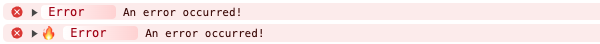
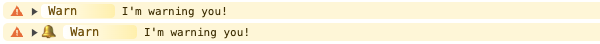
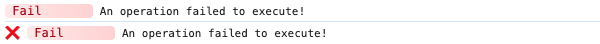
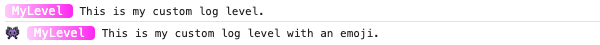

# Terminators

When you have an Adze [log](./log-class.md) instance, and have applied your desired
[modifiers](modifiers.md), you must terminate the method chain. The methods used to terminate the
chain are called **terminators**.

Adze comes with **9** default log level terminators, all of which can be [configured](configuration).

| Level | Name                | Standard Method Used |
| ----- | ------------------- | -------------------- |
| 0     | [alert](#alert)     | error                |
| 1     | [error](#error)     | error                |
| 2     | [warn](#warn)       | warn                 |
| 3     | [info](#info)       | info                 |
| 4     | [fail](#fail)       | info                 |
| 5     | [success](#success) | info                 |
| 6     | [log](#log)         | log                  |
| 7     | [debug](#debug)     | debug                |
| 8     | [verbose](#verbose) | debug                |

In addition to the default log levels, Adze provides a handful of other special terminators.

| Name                  | Description                                                                                                                                                                                                        |
| --------------------- | ------------------------------------------------------------------------------------------------------------------------------------------------------------------------------------------------------------------ |
| [clear / clr](#clear) | An alias for `console.clear()`.                                                                                                                                                                                    |
| [custom](#warn)       | Allows you to generate a log for a custom log level.                                                                                                                                                               |
| [seal](#seal)         | Allows you to create a child logger by sealing your log chain into a new logger class.                                                                                                                             |
| [sealTag](#sealtag)   | Allows you to create a child logger by sealing your log chain into a [template string literal tag function](https://developer.mozilla.org/en-US/docs/Web/JavaScript/Reference/Template_literals#tagged_templates). |
| [thread](#thread)     | Creates a context thread that can capture data points throughout multiple scopes of your application.                                                                                                              |

## Level Terminators

These are the basic level terminators that come with Adze by default.

### alert

This level should only be used for logs that require immediate attention. This should be used
sparingly and only for the most critical of errors.

**Default log level** = 0

**Standard Log Method:** `console.error()`

_This is not a standard API._

#### Interface

```typescript
class BaseLog {
  public alert(...args: unknown[]): void;
}
```

#### Example

```javascript
import adze from 'adze';

adze.alert('Something went horribly wrong!');
// With emoji's enabled
adze.withEmoji.alert('Something went horribly wrong!');
```

#### Browser Output


#### Server Output


---

### error

Use this for logging fatal errors or errors that impact functionality of your application.

**Default log level** = 1

**Standard Log Method:** `console.error()`

[**MDN Docs**](https://developer.mozilla.org/en-US/docs/Web/API/Console/error)

#### Interface

```typescript
class BaseLog {
  public error(...args: unknown[]): void;
}
```

#### Example

```javascript
import adze from 'adze';

adze.error('An error occurred!');
// With emoji's enabled
adze.withEmoji.error('An error occurred!');
```

#### Browser Output



#### Server Output


---

### warn

Use this for logging issues that may impact app performance in a less impactful way than an error.

**Default log level** = 2

**Standard Log Method:** `console.warn()`

[**MDN Docs**](https://developer.mozilla.org/en-US/docs/Web/API/Console/warn)

#### Interface

```typescript
class BaseLog {
  public warn(...args: unknown[]): void;
}
```

#### Example

```javascript
import adze from 'adze';

adze.warn("I'm warning you!");
// With emoji's enabled
adze.withEmoji.warn("I'm warning you!");
```

#### Browser Output



#### Server Output


---

### info

Use this for logging general insights into your application. This level does not indicate any
problems.

**Default log level** = 3

**Standard Log Method:** `console.info()`

[**MDN Docs**](https://developer.mozilla.org/en-US/docs/Web/API/Console/info)

#### Interface

```typescript
class BaseLog {
  public info(...args: unknown[]): void;
}
```

#### Example

```javascript
import adze from 'adze';

adze.info('App information');
// With emoji's enabled
adze.withEmoji.info('App information');
```

#### Browser Output


#### Server Output


---

### fail

Use this for logging network communication errors or other non-fatal errors that do not break your
application.

**Default log level** = 4

**Standard Log Method:** `console.info()`

_This is not a standard API._

#### Interface

```typescript
class BaseLog {
  public fail(...args: unknown[]): void;
}
```

#### Example

```javascript
import adze from 'adze';

adze.fail('An operation failed to execute!');
// With emoji's enabled
adze.withEmoji.fail('An operation failed to execute!');
```

#### Browser Output



#### Server Output


---

### success

Use this for logging successful network communications or other successful operations within your
app.

**Default log level** = 5

**Standard Log Method:** `console.info()`

_This is not a standard API._

#### Interface

```typescript
class BaseLog {
  public success(...args: unknown[]): void;
}
```

#### Example

```javascript
import adze from 'adze';

adze.success('An operation was successful!');
// With emoji's enabled
adze.withEmoji.success('An operation was successful!');
```

#### Browser Output


#### Server Output


---

### log

Use this for general logging that doesn't apply to any of the lower levels.

**Default log level** = 6

**Standard Log Method:** `console.log()`

[**MDN Docs**](https://developer.mozilla.org/en-US/docs/Web/API/Console/log)

#### Interface

```typescript
class BaseLog {
  public log(...args: unknown[]): void;
}
```

#### Example

```javascript
import adze from 'adze';

adze.log('Logging a message.');
// With emoji's enabled
adze.withEmoji.log('Logging a message.');
```

#### Browser Output


#### Server Output


---

### debug

Use this for logging information that you typically do not want to see unless you are debugging a
problem with your application. This is typically hidden by default.

**Default log level** = 7

**Standard Log Method:** `console.debug()`

[**MDN Docs**](https://developer.mozilla.org/en-US/docs/Web/API/Console/debug)

#### Interface

```typescript
class BaseLog {
  public debug(...args: unknown[]): void;
}
```

#### Example

```javascript
import adze, { setup } from 'adze';

// We need to raise the active log level to see debug logs.
setup({
  activeLevel: 'debug',
});

adze.debug('Debugging an issue.');
// With emoji's enabled
adze.withEmoji.debug('Debugging an issue.');
```

#### Browser Output


#### Server Output


---

### verbose

Use this for logging extremely detailed debugging information. Use this level when the values you
are logging are granular enough that they are no longer easily human readable.

**Default log level** = 8

**Standard Log Method:** `console.debug()`

_This is not a standard API._

#### Interface

```typescript
class BaseLog {
  public verbose(...args: unknown[]): void;
}
```

#### Example

```javascript
import adze, { setup } from 'adze';

// We need to raise the active log level to see verbose logs.
setup({
  activeLevel: 'verbose',
});

adze.verbose('Logging some extreme detail.');
// With emoji's enabled
adze.withEmoji.verbose('Logging some extreme detail.');
```

#### Browser Output


#### Server Output


---

## Other Terminators

Aside from the basic [level terminator](#level-terminators) methods, Adze also exposes a few others
for different utility purposes.

### clear / clr

This terminator simply exists as an alias for `console.clear()`.

[**MDN Docs**](https://developer.mozilla.org/en-US/docs/Web/API/Console/clear)

**Standard Log Method:** `console.clear()`

#### Interface

```typescript
class BaseLog {
  public clear(): void;
  public clr(): void;
}
```

#### Example

```javascript
import adze from 'adze';

adze.log('This is a log to be cleared.');
adze.clear();
```

## &nbsp;

### custom

Terminates the log at the provided custom log level. Custom log levels are defined within the Adze
configuration object under the [`levels`]() property. Adze can be configured by the [setup]()
function or by passing configuration to the [seal](#seal) or [sealTag](#sealTag) terminator.

[Configuration Details]()

_This is not a standard API._

#### Interface

```typescript
class BaseLog {
  public custom(levelName: string, ...args: unknown[]): void;
}
```

#### Example

```javascript
import adze, { setup } from 'adze';

setup({
  levels: {
    myLevel: {
      levelName: 'myLevel',
      level: 4,
      method: 'info',
      style:
        'font-size: 12px; border-radius: 4px; padding-right: 10px; background: linear-gradient(to right, #ffcafc, #ff02f2); color: #fff; border-color: #e3bbbb;',
      terminalStyle: ['white', 'bgMagenta'],
      emoji: '👾',
    },
  },
});

adze.custom('myLevel', 'This is my custom log level.');
adze.withEmoji.custom('myLevel', 'This is my custom log level with an emoji.');
```

#### Browser Output



#### Server Output


---

### seal

The seal terminator is used for creating child loggers.

It allows you to setup your child logger by writing a log chain as you normally would, except that
instead of terminating it with a log level, you seal the configuration into a new
[log class](./log-class.md).

The new [log class](./log-class.md) inherits all of the configuration of your log chain.

_This is not a standard API._

#### Interface

```typescript
class BaseLog {
  public seal(cfg?: UserConfiguration): SealedLog;
}
```

#### Example

```javascript
import adze from 'adze';

const logger = adze.withEmoji.ns('my-app').seal();

logger.log('This is a log from my sealed child logger.');
```

#### Browser Output


#### Server Output


---

### sealTag

The sealTag terminator is used for creating child loggers for a specific log level that can be used
as a convenient [string template tag function](https://developer.mozilla.org/en-US/docs/Web/JavaScript/Reference/Template_literals#tagged_templates).

For instance, if you find yourself logging errors in catch functions repeatedly, you can create an
`Err` template tag function for logging the errors.

_This is not a standard API._

#### Interface

```typescript
class BaseLog {
  public sealTag(method: string, cfg?: UserConfiguration): SealedLog;
}
```

#### Example

```javascript
import adze from 'adze';

const ERR = adze.withEmoji.sealTag('error');

const url = 'http://www.example.com/';
try {
  const res = fetch(url);
} catch (e) {
  ERR`Failed to fetch from ${url}!`;
}
```

#### Browser Output


#### Server Output


---

### thread

The thread terminator is used to create a [Mapped Diagnostic Context](https://www.baeldung.com/mdc-in-log4j-2-logback)
where context values are recorded from multiple scopes but are output together in a single log. This
is used in conjunction with the [dump modifier](./modifiers.md#dump) for outputting the thread's
values.

Refer to [threading](../getting-started/threading.md) in the Getting Started guide for more
information.

_This is not a standard API._

#### Interface

```typescript
class BaseLog {
  public thread(key: string, value: unknown): void;
}
```

#### Example

```javascript
import adze from 'adze';

function add(a: number, b: number) {
  const answer = a + b;
  adze.label('maths').thread('added', { a, b, answer });
  return answer;
}

function subtract(x: number, y: number) {
  const answer = x - y;
  adze.label('maths').thread('subtracted', { x, y, answer });
  return answer;
}

add(1, 2);
subtract(4, 3);

adze.label('maths').dump.info('Results from our thread');
```

#### Browser Output


#### Server Output


