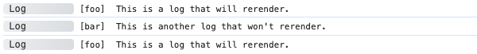
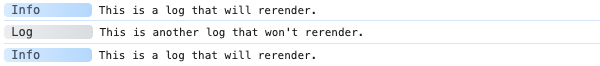
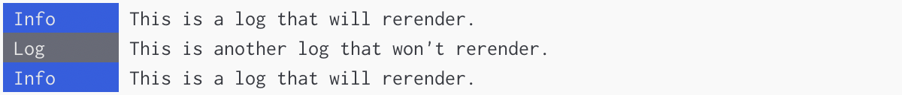
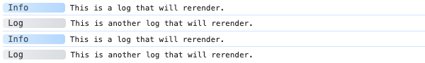

# Tools

The tools are a collection of methods that allow you to recall cached logs from a console, such as
the browser dev tools console. This can be useful if you want to clear the logs and then reprint
specific logs to narrow them down.

For a detailed tutorial on how to use them, refer to the [Tools](../getting-started/tools.md) page
of the [Getting Started](../getting-started/introduction.md) guide.

## Public Methods

These are used for retrieving data and accessing the browser console tools.

### filterByLabel

---

Rerenders all logs that match the provided label name.

#### Interface

```typescript
class Tools {
  public filterByLabel(label: string): void;
}
```

#### Example

```typescript
import adze, { setup } from 'adze';

const store = setup({
  cache: true,
});

adze.label('foo').log('This is a log that will rerender.');
adze.label('bar').log("This is another log that won't rerender.");

// Get the log cache.
store.tools.filterByLabel('foo');
```

#### Browser Output



#### Server Output


### filterByNamespace

---

Rerenders all logs that match the provided namespaces.

#### Interface

```typescript
class Tools {
  public filterByNamespace(...namespace: string[]): void;
}
```

#### Example

```typescript
import adze, { setup } from 'adze';

const store = setup({
  cache: true,
});

adze.ns('foo', 'bar').log('This is a log that will rerender.');
adze.ns('bar').log("This is another log that won't rerender.");

// Get the log cache.
store.tools.filterByNamespace('foo');
```

#### Browser Output


#### Server Output


### filterByLevel

---

Rerenders all logs that match the provided level selector.

#### Interface

```typescript
class Tools {
  public filterByLevel(level: LevelSelector): void;
}
```

#### Example

```typescript
import adze, { setup } from 'adze';

const store = setup({
  cache: true,
});

adze.info('This is a log that will rerender.');
adze.log("This is another log that won't rerender.");

// Get the log cache.
store.tools.filterByLevel('info');
```

#### Browser Output



#### Server Output



### renderAll

---

Rerenders all cached logs.

#### Interface

```typescript
class Tools {
  public renderAll(): void;
}
```

#### Example

```typescript
import adze, { setup } from 'adze';

const store = setup({
  cache: true,
});

adze.info('This is a log that will rerender.');
adze.log('This is another log that will rerender.');

// Get the log cache.
store.tools.renderAll();
```

#### Browser Output



#### Server Output


