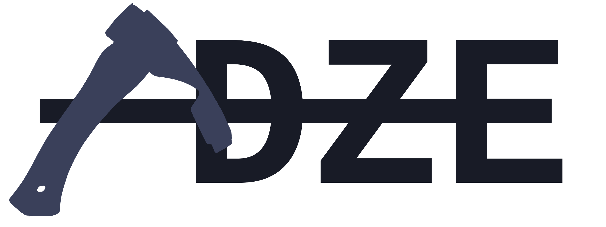

> Adze - [a cutting tool that ... is used chiefly for shaping wood](https://www.merriam-webster.com/dictionary/adze).

Adze was chosen as a name for this library to maintain solidarity with the logging puns and to emphasize that this library is a tool for shaping the logs of your application.

## Why should I use Adze?

As you may already be aware there are a number of other good JS libraries out there to assist with logging. The focus of Adze is to provide a convenient and clean API, provide first-class TypeScript support, and to empower you to take command of your logs rather than pigeon-hole you into a specific way of handling them.

Here is a list of the features that Adze provides:

- First-class TypeScript support.
- A fluent, chainable API for creating logs.
- Attractive out-of-the-box log styling (EMOJI'S INCLUDED)
- Full control over all aspects of your log configurations.
- Standard levels are customizable
- Create custom log levels with unique styling
- A global log store for recalling logs and overriding configuration
- Log Listeners that empower you to do with your logs as you wish
